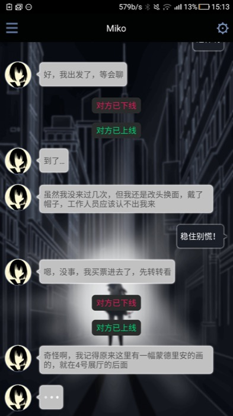
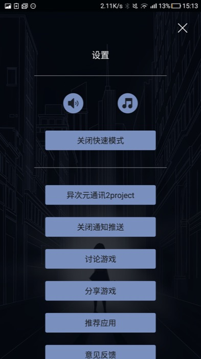

#Game Note - 异次元通讯录2

> 写这个东西的目的就是为了让自己专心复习....
> 
> 因为发现自己容易沉迷新游戏, 可能是机核网的广播听太多了造成了一种玩游戏的心理氛围. 虽然并不觉得有太多错, 不过过于玩游戏确实是一种"用有限的时间挑战无限时间"的事情.
> 
> 毕竟我们都是和一些循环和判断构成的软件进行交互, 而编程不就是把许多状态, 甚至无限的状态归纳并执行的步骤嘛.
> 
> 不过许多游戏有很多好的想法, 每个游戏也有自己的有点和缺点.
> 
> 也许最后我也不会去做游戏, 但是就按照自己的视角分析一下并不是什么坏事
> 
> 自己并不是一个擅长游戏的人, 反应力和记忆力都不是很好所以经常只能玩初级难度和关卡. 但是我相信真正的core player也只是少数, 就算是core player也愿意在没事儿的时候尝试新的游戏. 所以一个新手测评也是有用的吧

##其实并不是科幻

不得不说现在国内的画师们的水平稳步上升呢, 虽然是经典的主角大逆光透视. 

这个构图我记得有地方介绍过是仿照某名画的, 表达了一种年轻人迎难而上斗天斗地斗地主的进取心. 

虽然在各种电影海报上很常见, 但是确实很适合一个冒险游戏的氛围. 

不过呢, 虽然题图十分酷炫而科幻, 但是就我弃坑的进度来说, 并没有感受到许多科幻元素, 反而卖萌和卖肉元素很多呢.

##第一印象

这是个设定上和"生命线"很相似的文字冒险游戏, 不得不说相比较于生命线, 它的交互更加符合我们使用微信和微博的习惯.

与主角miko酱聊天的时候, 她的打字是需要一定时间的, 而且在她打字和我们思考选项的时候会出现一个像是whatsapp里面一样的有三个跳动的点的提示. 确实能让代入感增强一些, 但是在玩了一段时间之后, 就会觉得这样有些多余, 因为我更想知道剧情的进展. 感觉这样的小动画太多了有点拖沓.

miko酱的聊天也很符合大家的聊天习惯, 是不是来个颜文字卖个萌什么的. 不过整体的人物性格有点...牵强? 感觉是为了各种萌要素然后很片面的粘上了许多个性. 写文章这种事儿需要慢慢练习的所以一起加油吧大家!

##感觉上有意思的各种系统

之前提到了这个游戏的微博和微信系统, 就让我在这里罗列一下我觉得做的挺好的各种系统吧

###日志

这个系统还挺眼前一亮的, 觉得整个维度一下子提高了许多. miko发日志的时间一般来说是下线时间. 第一次打开这个类似微博的日志的时候, 感觉一下子就被带入进去了!

就我玩到的地方来说, 整个日志的作用就是看萌图. 还有就是收集图鉴啦, 但是**对于推动主剧情完全没有作用**. 我觉得设计组是想用日志来丰富人物的形象, 但是**这种把各种二次元萌元素堆在一起然后就来卖萌的感觉还是有点小违和.**..

###快速模式

游戏里面有个"快速模式", 好像也没有帮助界面或者提示,来让我明白这个是用来做什么的.

不过根据字面意思应该是加快游戏中时间流逝的吧.

虽然我的手机垃圾导致根本没有提示, 但是这个真是体谅了我这种没什么耐心一直等着剧情发展的玩家.

##吐槽

首先表达对这种偶尔拿起玩一下然后就可以放下的游戏的喜爱之情, 上手门槛很低呀而且不会很占用时间, 是一个解决碎片化时间先要打发时间获得一段故事的好方法.

可能是经验不太足的原因吧, 有些时候游戏的选项让我感到莫名其妙. 而且对于选项造成的结果也没什么道理...

死了两次, 一次因为地铁逃票...另一次因为试了一下密码锁...

总之感觉就是个不作死就不会死的设定. 

不过**这个度好像有点过了**, 感觉随便尝试了一件小事儿就作了个大死被失联.

##想要变得更好

确实有很多地方自己感觉被代入了整个事件, 但是只能二选一的选项让我是不是跳戏, 因为两个选项都不是我想选的额.

如果从游戏制作的角度来说, 我觉得是剧本对于玩家心理的把握还不是很到位. 但是有个想法, **能不能给游戏装上chatbot呢?**

玩家可以向AI提出各种问题, 就像有个文字版的siri. 但是AI会引导玩家接近一个故事, 当然实时游戏的设定确实很棒可以保留.

玩家的提问也是让玩家了解世界观和人物性格的一个好方法. 

当然, 现在的AI技术可能还没有到能通过图灵测试又方便开发的程度. 不过这是可以尝试的呢, 如果真的有个AI客服一样的存在, 那我们就可以做一个在**微信群里面的密室逃脱游戏?**

另外, 受到"日志"系统的启发, 做一个**文字开放世界冒险如何?**.

在网上搜了一下已经有些游戏这样做了, [这不是文字冒险游戏的时代，但150万字的《巫术》卖出了150万套](http://www.chuapp.com/article/272901.html), 这篇文章里面的"80天"这个游戏, 有空可以试试看呢.

##最后

恩没什么好总结的, 好好复习准备期末考试.

