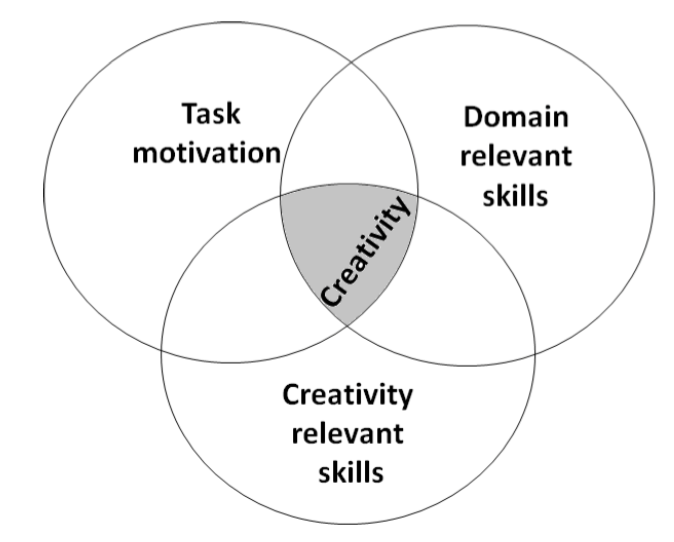
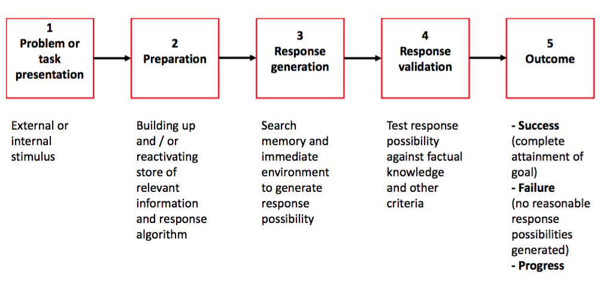
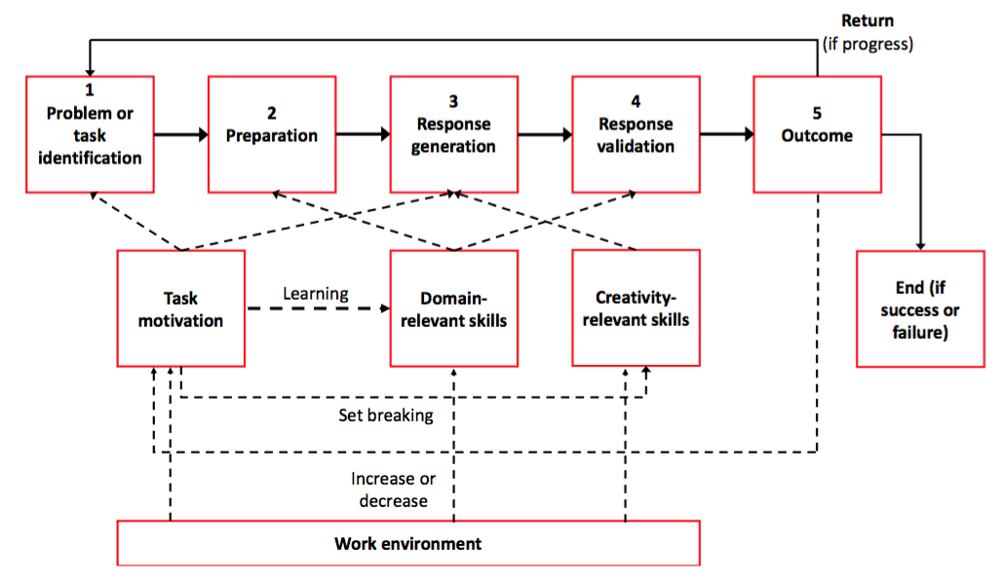
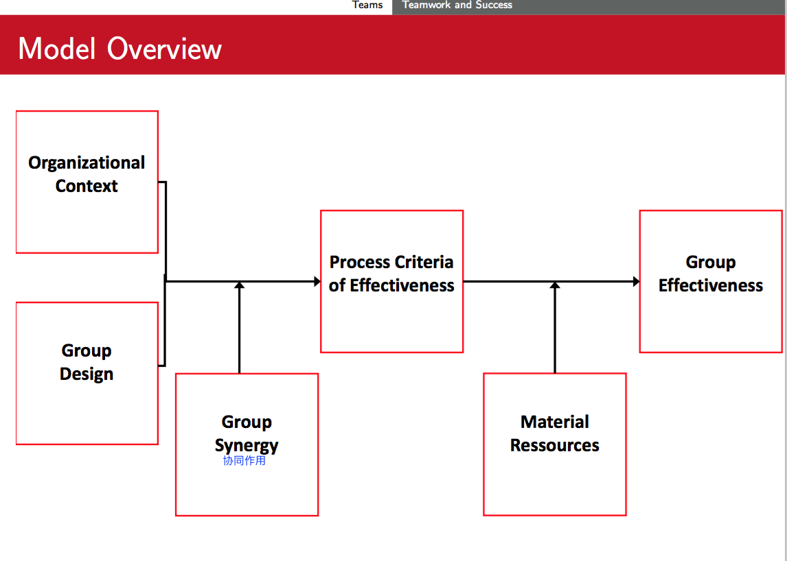

#Human side of Innovation - Preparing the final test

##Possible Elements in the Exam

###Creativity

#### Measurement of creativity: Via behavior in context vs via personality scales.**Discuss Advantages / Disadvantages**
  
**Difference of Innovation and Creativity**

Creativity:

- Generation of novel and useful ideas 
- Absolute (”true”) novelty
- Partially an intra-individual (自我节点内的) cognitive process
  

Innovation:

- Production of creative ideas and implementation 
- Relative novelty (e.g., ideas may be adopted from otherorganizations)
- Primarily an inter-individual(人与人之间的) social process

**Measurement of creativity**

Three Components of Creativity (Amabile, 1996a)

Componential theory: 3 main creativity facilitators (= components)

1. Domain-relevant skills (factual knowledge, skills and experience in a specific
field)
2. Creativity-relevant skills (e.g., innovative cognitive style, knowledge of
techniques to produce creative ideas)
3. Task motivation (intrinsic and extrinsic)

Creativity intersection: *Highest creativity when an individual is high in all three components!*

#### Amabile’s model on creativity: remember the example we discussed (MIT,Amazon Kindle)

**Amabile’s model on creativity**

**Positive Organizational Influence**

- Increase intrinsic motivation
:
	- Freedom & autonomy
	- Give optimal challenge
	- Assign tasks to match interests

- Increase extrinsic motivation
	- Confirm competence through recognition
	- Give a clear strategic direction
	- Provide sufficient resources

- Diminish demotivational extrinsic factors
	- Do less surveillance and establish fewer rigid procedures
	- Reduce expectation of too critical evaluation
	- Give realistic deadlines

- Domain-relevant skills
	- Provide training in relevant factors 
	- Provide support for critical success factors 
	- Assign tasks to match skills

- Creativity-relevant skills
	- Encourage unconventional thinking 
	- Support alternative solutions
	- Give time to fully capture situations and problems

**Analyzing the mini case of Kindle**


Please discuss the creative process behind this development based on Amabile’s model of creativity.

> TODO: 我要自己试着用前面的model和这些positive的行为来分析
> 后面也有一些经验的结论, 这些好像也和这个minicase 相关

####Brainstorming!

> TODO: 主要是说brainstorm的问题什么的

###Teams

#### Given Situation / task: Describe how a team can be useful in such a situation: Discuss positive factors (such as complementarities, specialisation, knowledgetransfer) as well a negative effects (such as free riding, coordination effort)

> TODO:我觉得不应该就这么点吧...每个优缺点就一句话? 

#####Advantages
**Complementarities:**

The task can be done faster / more e ciently with more people

**Specialisation**

Each team member may concentrate on a certain task and fulfill this task better, e.g. due to learning effects

**Knowledge transfer**

Team members possess idiosyncratic knowledge, which is helpful for other team members

#####disadvantages

Free-Riding problem

Coordination effort

####Teamwork and success (hackman model): Similar question as above (Amabile) possible

###Interactive value creation

####2 fundamental problems of innovation: Discuss in context

####One specific method: mini case

####Community management