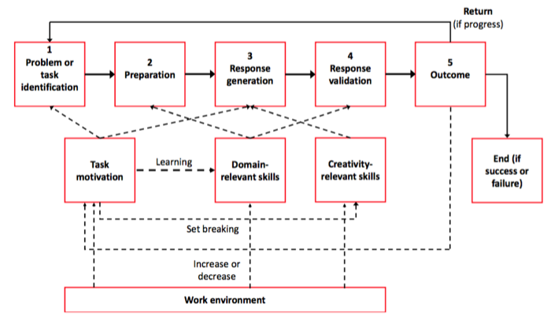
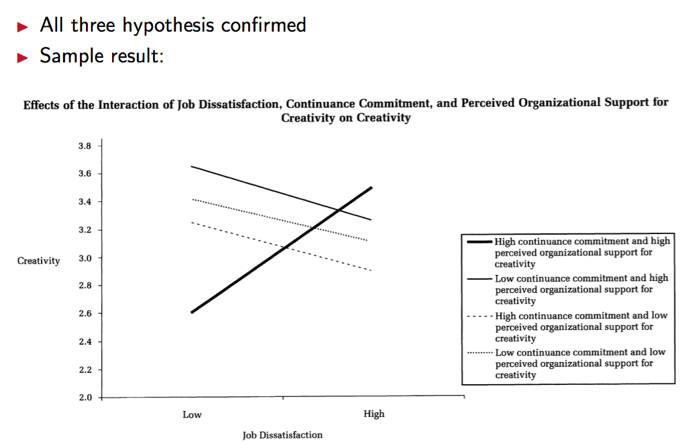
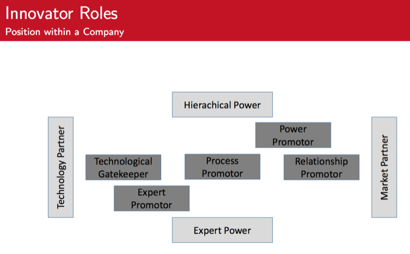

#Human side of Innovation - Preparing the final test

##Possible Keypoint in Exam

###Creativity

####>>>SUMMARY

- Introduction and definition
    - Definition of creativity
    - Ways to measure creativity
- Amabile’s theory on creativity
    - 3 components (domain-relevant skills, creativity-relevant skills, task
motivation) and their effects on 5 phases of creativity
    - Effects of organizational work environment on motivation and creativity
- Brainstorming
    - Understand brainstorming problems and possible solutions
- Discussion of empirical studies on creativity 
    -  Several factors influence creativity
    - Importance of interaction effects

#### >>>Measurement of creativity: Via behavior in context vs via personality scales.**Discuss Advantages / Disadvantages**
  
**Difference of Innovation and Creativity**

Creativity:

- Generation of novel小说 and useful ideas 
- Absolute (”true”) novelty
- Partially an intra-individual (自我节点内的) cognitive process
  

Innovation:

- Production of creative ideas and implementation 
- Relative novelty (e.g., ideas may be adopted from other organizations)
- Primarily an inter-individual(人与人之间的) social process

**Measurement of creativity**

Three Components of Creativity (Amabile, 1996a)

Componential theory: 3 main creativity facilitators (= components)

1. Domain-relevant skills (factual knowledge, skills and experience in a specific
field)
2. Creativity-relevant skills (e.g., innovative cognitive style, knowledge of
techniques to produce creative ideas)
3. Task motivation (intrinsic and extrinsic)

Creativity intersection: *Highest creativity when an individual is high in all three components!*

#### >>>Amabile’s model on creativity: remember the example we discussed (MIT,Amazon Kindle)

**Amabile’s model on creativity**

**Positive Organizational Influence**

- Increase intrinsic motivation
:
	- Freedom & autonomy
	- Give optimal challenge
	- Assign tasks to match interests

- Increase extrinsic motivation
	- Confirm competence through recognition
	- Give a clear strategic direction
	- Provide sufficient resources

- Diminish demotivational extrinsic factors
	- Do less surveillance and establish fewer rigid procedures
	- Reduce expectation of too critical evaluation
	- Give realistic deadlines

- Domain-relevant skills
	- Provide training in relevant factors 
	- Provide support for critical success factors 
	- Assign tasks to match skills

- Creativity-relevant skills
	- Encourage unconventional thinking 
	- Support alternative solutions
	- Give time to fully capture situations and problems

**Analyzing the mini case of Kindle**


Please discuss the creative process behind this development based on Amabile’s model of creativity.

> TODO: 我要自己试着用前面的model和这些positive的行为来分析
> 后面也有一些经验的结论, 这些好像也和这个minicase 相关

#### >>>Brainstorming!

> TODO: 主要是说brainstorm的问题什么的

**What is Brainstorming?**

Brainstorming is a method of group problem solving

**Possible Threats**

- Production blocking
  - No uninterrupted flow of thought possible
  - Only one person can speak at one time
  - While others’ speak, one’ own idea production is blocked or ideas are being forgotten
- Social loafing
  - Participants may not work as hard as they would alone, especially if they perceive their contribution to be unidentifiable
- Evaluation anxiety and conformity
  - Fear that others may negatively evaluate one’s ideas
  - Members may communicate traditional or similar ideas to ”fit in” and not to diverge from others
- Downward norm setting
  - Performance across group members often converges
  - Brainstorming participants sometimes tend to match their performance to that of the least productive members)

**Better method:**

BrainWriting


- Nominal group technique (sharing and discussing ideas after independently
writing them down) 
- Electronic brainstorming (individual computer stations to type in ideas, while all or a sample of all ideas are projected on the wall or shown in a separate window on the computer screen)
- Diversification of the team (e.g. regarding training) and membership change (exit of old member and entry of new member)
- Trained facilitators minimize some threats, e.g. ensure that only the ideas themselves and not anecdotes are communicated

BrainWarming

In brainwarming graph, the goal grows downward into refined subgoals. 

Resoureces are interacted together and grow upward. 

When the two directions connect, solutions start to emerge.

####>>>Discussion of Empirical Studies on Creativity

#####The Impact of Mood on Creativity
Positive mood facilitates creative thinking

- Daily positive mood positively predicted daily creative thought (judged by expert raters) on the same day and with a 1-2 day delay
- Aggregated monthly positive mood positively predicted monthly coworker- rated creativity
- Most creative incidents (86%) associated with positive emotional reactions

But there are also opposing results:

- Negative mood positive for creativity if organization recognizes and rewards creativity (George and Zhou, 2002)

#####Motivation, Bureaucracy and Creativity

Situational influences (higher-level team climate factors) may weaken or strengthen the effect of individual differences
→ **Person-in-situation theory**

研究雇员motivation和组织架构的关系

- Employee motivation was studied using 3 types of goal orientations
	- **Learning orientation** (sample item: I often look for opportunities to develop new skills and knowledge)
  	- **Performance prove orientation** (sample item: I’m concerned with showing that I can perform better than my co-workers)
  	- **Performance avoidance orientation** (sample item: I’m concerned about taking on a task at work if my performance would reveal that I had low ability)

- 2 bureaucracy factors
  	- Centralization: 
  		- How is power distributed in an organizational hierarchy? 
  		- Is there a chain of command? 
  		- Are employees encouraged to participate in decision making
  		- Sample item: The team leader uses my work group’s suggestions to make decisions that affect us
  	- Formalization: 
  		- Which rules are clearly specified, which procedures standardized? 
  		- Sample item: Our work involves a great deal of paperwork and administrations

RELATIONSHIP:

- **Performance avoidance orientation** had a negative relation with creativity (consistent with the notion that this orientation disposes individuals to be less creative because of risk of failure and the possibility of appearing incompetent)

- Employees’ **performance prove orientation** was positively related to creativity when formalization was low, but not when it was high

- When centralization was low
  	- **learning orientation** was positively related to creativity
  	- **performance avoidance orientation** was less negatively related to creativity   

- When formalization was low
  - performance prove orientation was positively related to creativity (see next slide)   
  - performance avoidance orientation was more negatively related to creativity

RESULT:

- To get creative results, managers should seek to understand employees’ **motivational orientations in context**, so the combination of individual disposition and bureaucratic context yields the most desirable *associations with creativity*.
- **Decentralization** brings out the best in learning-oriented employees and attenuates the negative of an avoid orientation on creativity. Thus, from a creativity perspective, decentralized decision making is attractive, *even when it does little for prove-oriented individuals*.
- **Formalized practices are a more complex issue**. Although the creativity of prove-oriented individuals thrives in less formalized contexts, *low formalization actually brings out undesirable tendencies in avoid-oriented team members*
- ”The conclusion would be that creativity is **best obtained** by (where possible) **not selecting avoid-oriented individuals **for a team, while creating a team context characterized by **high levels of decentralized decision** making and **low formalization**, to let learning-oriented and prove-oriented individuals flourish.” (p. 638)

#####When Job Dissatisfaction Leads to Creativity

What is job dissatisfaction:

- Reactions to job dissatisfaction
  - Exit: Leave the company (**active**, **destructive** reaction)
  - Neglect: Lower effort (**passive** reaction)
  - Loyalty: Accept status quo (**passive** reaction)
  - Voice: Do something about it (**active**, **constructive** reaction)

How to measure it:

- Creativity:
	- 13 item scale (such as ”Person suggest new ways to achieve goals or objectives”)
- **Job dissatisfaction**:
    - 3 item scale (such as ”In general I like working at this company”; ”In general, I like my job”)
- **Continuance commitment**:
    - 6 item scale (such as ”Right now, staying with this company is a matter of necessity as much as desire”)
- Useful feedback from coworkers:
    - 3 item scale (such as ”I find the feedback I receive from my coworkers very useful”)
- Coworker helping and support:
    - 4 item scale (such as ”We help each other out if someone falls behind in their work”)
- Perceived organizational support for creativity:
    - 4 item scale (such as ”Creativity is encouraged at this company”; ”The reward system encourages innovation”)

RESULT:

- Implications
    - Job dissatisfaction is not necessarily undesirable for organizations
    - Managers should (of course) not try to increase job dissatisfaction, but try to create a suitable work environment that even in this unfavorable situation positive results are possible
⇒ Positive effect on worker and organization possible
-  Critique and Further Research
    - Dyadic data: Biased responses minimized
    - Cross-sectional study: Difficult to assess causality
    - What are the effects of creative behavior in response to job dissatisfaction?
    - What is the effect of individual characteristics of workers on the analyzed
hypotheses (e.g. self-esteem)?

---

###Teams

#### Given Situation / task: Describe how a team can be useful in such a situation: Discuss positive factors (such as complementarities, specialisation, knowledgetransfer) as well a negative effects (such as free riding, coordination effort)

> TODO:我觉得不应该就这么点吧...每个优缺点就一句话? 

DEFINITION

A team can be defined as **a social system of two or more people**, which is embedded in an organization (context), whose members **have a common identity**, and who **collaborate on a common task** (teamwork).

>这里的chance of teamwork, 侧重于TEAMWORK, 也就是"collaborate on a common task", 讨论的是在做事儿的时候的chance和risk

#####Chances of Teamwork (Based on Scholl, 2005)

- For the organization
    - **Improved coordination** due to **interdependencies**(相互依赖) in teams
    - Better decision making (process) due to integration of different perspectives
    - Easier implementation of decisions due to consideration of various interests in the decision making process
    - Improved e ciency due better coordination of specialised capabilities
    - Better customer service due to bundling of competencies in customer contact

- For the employee
    - Faster familiarisation due to information exchange with other team members
    - Self-awareness and reflections of own behavior through feedback of other team members
    - Easier learning of new skills and acquiring knowledge
    - Better identification with the company through sense of belonging to the team (within the company)
    - Satisfaction of needs for social contacts

#####Risks of Teamwork (Based on Scholl, 2005)

- For the organization
    - **Reduction of decision quality** due to **peer pressure**
    - Increased coordination effort (especially due to interdependencies in teams)
    - Increased risk of conflicts due to different personal or professional views
    - Increased resistance of a teams against (wanted) changes due to an internal ”subculture“ .

- For the employee
    - Less motivation due to diminished influence on own performance
    - Reduced performance and dedication due to ”social slack“ of (some) team members
    - Negative influence of internal conflicts on members’ feelings
    - Conformity pressure can lead to lower performance

>下面说的advantage和problem是关于TEAM这个组织形式的, 只要有这个组织形式存在, 就会产生什么问题

#####Advantages
**Complementarities:**

The task can be done faster / more effciently with more people

**Specialisation**

Each team member may concentrate on a certain task and fulfill this task better, e.g. due to learning effects

**Knowledge transfer**

Team members possess idiosyncratic knowledge, which is helpful for other team members

#####Problems

Free-Riding problem

Coordination effort

####Free-riding

What Influences the Decision to Free-ride?

- Team size
- Relations within the team     
- Observability of effort
- Punishments
- Norms

**Team Size:** 
    
The larger a team, the smaller the individuals’s impact on the outcome

Plus, it is harder to observe individual effort of each member  

CONCLUSION The larger the team, the higher the incentives to free-ride

**Team composition:**    
    
- Team composition is thus facing the following problems:
    - How many members should a team have?
    - Who should be part of the team?
    - Is free-riding punished? Are there any individual incentives?
    - What kind of working norm is there in the team / the organization?

If the team is composed of very heterogeneous(各种各样的) members with heterogeneous tasks, it is more diffcult to observe and judge individual effort

CONCLUSION The more homogeneous a team, the lower the incentives to free ride

####Design of Incentives for Teams

*Explicit Incentives*

- Team bonus (e.g. Bonus for completion of an R&D project in time)
    - Problem: Only if the bonus is based on individual effort it counters the free-riding problem
    - This, however, requires observability of the individual effort
- Profit sharing (variable part of the salary depends on company profit)
    - Huge free riding problem (Large group, low observability, little influence)
- Stocks and stock options
    - Basically the same effect (and problems) as profit sharing (only a different
success measurement)

*Implicit Incentives: Norms*

In order to **improve the team coordination and spirit**, the company / team leaders max try to establish team norms

Such norms **generate behaviour expectations** against other team members and thus have (implicit) effect on team behaviour and activities

Norms can concern and **affect all kinds of behaviour** in R&D teams, such as performance norms, communication norms, cooperation norms

Considering the previous formal analysis: If there are established team norms, **deviation from the norm causes ”costs“** for the deviating team member

>偏离了团队价值观!就是和其他人不能友好相处

*Problems with Norms*

>建设团队价值观, 准则的时候,会遇到的问题

- Search for suitable norms (What kind of norms are right for this particular team, suitable for the organization culture?)
- Norm establishment (Exemplifying norms by higher management, honoring of members who work accordingly)
- Norm control (Supervision, sanctioning: Suitable in an R&D team (?)).
- Adaptation of norms (Reaction to new conditions, new team members, new
tasks).

>但是这些问题都不会很危险, 因为:

*Why is it not that Critical?*

- Intrinsic motivation (People in R&D often actually like doing their job) - Other benefits (Working in the team leads to personal benefits)
- Commitment to the team (Feeling of a community)
- Reciprocity (Hope that others will engage as well)
- Trusted partnership with employer
- Teamwork is perceived as a good thing – and should therefore be supported

####Idea Generation, Creativity and Incentives (Toubia, 2006)


RESULT

The paper shows that different incentive schemes may trigger different behaviour

- It appears that extrinsic incentives are **not detrimental to creativity** (contrary to some psychological literature)
- **Impact based incentives** trigger exploration 
- Incentives need to **fit to the type** of task

>实验让大家提点子,然后用三种不同的奖励方式来奖励
>
>(1) Flat condition: Participants received a flat reward of $10
>
>(2) Own condition: Participants rewarded based exclusively on their own contribution ($3 for each new original idea submitted)
>
>(3) Impact condition: Participants rewarded based on the impact of their ideas: ($2
for each new idea that builds on one’s own idea)
>
>上面提到的 **Impact based incentives** 就是基于影响力的激励



####Teamwork and success (hackman model): Similar question as above (Amabile) possible

>这个model是用来衡量一个team是不是有效率, 这个team的表现怎么样的工具

It provides a **diagnostic tool** to assess and design work environments for work groups in organizations

three process criteria of effectiveness 

- Effort applied to the group task
- Amount of knowledge and skill applied to the group task 
- Task-appropriate performance strategies

Each of these criteria is influenced by the **organizational context** and the **group design**, with **group synergy** as a moderator(调节器)

>这里的逻辑是这样的: 
>
>一个team的效率首先分成两部分来评估:
>
>1. Process Criteria of Effectiveness((衡量teamwork)效率的过程标准?): 
>2. Material Ressources (物质资源)
>
>其中Process Criteria of Effectiveness又再分成三个小部分评估
>
>1. Organizational Context
>2. Group Design
>3. Group Synergy
>
>评估的话总要有个标准吧, 于是这个Hackman提出了对着三个小部分评估的标准
>
>1. Effort applied to the group task
>2. Amount of knowledge and skill applied to the group task 
>3. Task-appropriate performance strategies
>
>下面就介绍了具体到每个标准, 在每个小部分里面是怎么评估的

**Effort applied to the Group Task**

- Group design: Structure of the task:
    - If the task requires a variety of **high-level skills** and has a **visible outcome**,
    - If this outcome has **consequences for other people**(对他人有意义), and the group is clearly
responsible for this outcome
    - If regular performance **feedback** is given --> Work will be perceived as meaningful leading to higher effort(如果工作被别人察觉到是有意义的, 那么就会更加努力工作) (这一点和下面的reward是不是重复了?)
- Organizational context: Reward system
    - Set **challenging**, **specific** performance objectives
    - Provide positive consequences for **excellent** performance
    - Focus on **group rewards** and objectives (not individual behaviour)
- Group synergy
    - Minimize coordination and motivation losses (e.g. through free-riding problem,
see above)
    - Create **shared commitment** 创造共有的义务

**Amount of knowledge and skill applied to the group task**

- Group design: Composition of the group
    - Individuals should have high task-relevant expertise
    - The group size should be large enough to do the work (but not too large) 
    - Members should have interpersonal skills (in addition to task expertise) 
    - Heterogeneity is moderately diverse
- Organizational context: Education system
    - The organization helps the team to obtain ”outside” experience to get along
with its work, such as educational resources (e.g. seminars)
- Group synergy
    - Minimize inappropriate weighting of member contributions (based on
task-irrelevant considerations such as demographic attributes, race, gender,
etc., or behavioral style)
    - Foster collective learning to increases the total pool of talent available for
task work

**Task-Appropriate Performance Strategies**

- Group design: Group norms (see above)
    - Norms should be clear and intense
    - Norms should support situation scanning and strategy planning (in order to
be adaptable)
- Organizational context: Information system
    - Clarity about the parameters of the performance situation (task requirements,
available material resources, people who receive/ review the group ”product”) 
    - Access to data about likely consequences of alternative strategies (analytic
tools to compare and evaluate probable consequences)
- Group synergy
    - Minimize slippage in strategy implementation 
    - Create innovative strategic plans

**Group Effectiveness**

- The productive output of the team should **meet or exceed the performance
standards** of the ”clients” / people (e.g. managers, executives) who receive
and / or review the output
- The social processes used in carrying out the work should **maintain or enhance
the capability of team members** to work together on subsequent team tasks 
- The group experience should, on balance, **satisfy rather than frustrate the
personal needs** of team members

**material resources** (Suffciency of material resources required to accomplish the task well and on time) is then a moderator of the influence of the process criteria of effectiveness on group effectiveness

#####Teamwork Quality and Success

>这个TWQ主要衡量的是team里面合作的程度是好是坏

TWQ: teamwork quality, TWQ is a comprehensive(全面的) measure of the quality of cooperations in teams

- Communication
    - Team members communicate frequently, directly and personally,
spontaneously
    - Information is shared openly by all team members, on time, precisely and
useful
- Coordination
    - The subtasks within the project are closely harmonized
    - Goals for subtasks are clear, fully comprehended and accepted by all team
members
- Balance of Member Contributions
    - Individual potential is recognized and members contribute in accordance to
their potential
    - Conflicts due to imbalance of contributions should be avoided
- Mutual Support
    - Team members help and support each other as the best they could   - Conflicts are easily and quickly resolved
    - Discussions and controversies are conducted constructively.
    - Suggestions and contributions are respected by all team members.
Suggestions are discussed and further developed.
    - The team is able to reach consensus regarding important issues.
- Effort
    - Every team member fully pushes the project.
    - Team members make the project their highest priority.
    - The team puts much effort into the project.
    - There are no conflicts regarding the efforts that team member put into the
project.
- Cohesion
    - The team members are strongly attached to the project.
    - It is important for the team members to be part of the team. Members feel
proud to be in the team.
    - All team members are fully integrated in the team.
    - There is personal attraction between the team members.

###Interactive value creation

why are there collaborations in R&D?

Basically, they expect similar advantages as we discussed in the session on teamwork, just on a higher scale

- Complementarities   
- Specialisation
- Knowledge transfer

####The Trade-offs of “Make or Cooperate”

>自己开发的好处

Developing new technologies internally can have several objectives

- Capabilities available (+building and renewing):
    - Carrying out a development project alone requires a firm to stretch and
challenge existing capabilities
    - Incentives to obtain new capabilities
- Protecting proprietary technologies:
    - Avoid exposure of core technologies to potential competitors  
    -  Maintain exclusive control over newly developed technology
- Controlling technology development:
    - Desire to control the whole development process and its results
    - Strategic and cultural reasons inside the company (importance of technology,
strong emphasis of own technological capabilities)
- Controlling costs:
    - Control of expenditures fully within own company

>合作开发的好处

Objectives of developing new technologies in collaboration

- Saving time:
    - Obtaining necessary skills and resources via collaboration usually is faster than
in-house development
    - Complementarities and specialization can lead to faster development
- Increasing flexibility:
    - Externally acquiring instead of building and owning necessary assets increases
the capability of a firm to respond to market change
- Enabling learning:
    - Close contact to other firms can enhance knowledge transfer and creation of
new knowledge applicable in further development efforts
- Sharing risk and costs:
    - Joint implementation of technology development efforts characterized by
uncertainty reduces individual firm’s share in the associated risks and costs

####2 fundamental problems of innovation: Discuss in context

- **Need Information**
	- Utility and preferences of customers
	- What kind of advantage should the information provide, what problem should be solved?
	- Access to need information allows
to put the right innovation to the market
- **Solution Information**
	- How can a certain need be satisfied with a product or service?
	- What kind of (chemical, physical, Need biological etc.) principle should be applied to solve a problem? Information
	- What kind of technology should be used?
  

Problem with Access to **Need information**

Sticky Information (von Hippel, 1994) 
   
- Access to customers often difficult Solution    
- Needs are oftentimes hard to Information
articulate(善于表达的)    
- Oftentimes people do not know what you want(ed) unless you see the solution    
- “If I had asked people what they
Doing things
right
Realization
wanted, they would have said
faster horses.” (Henry Ford(?))


**Problem with Solution Generation (Information)**

Local Search Bias

- For (new) problems, people often try
known solution (principles)
- Oftentimes, this is useful (in particular if
Need the problem is only slightly modified)
- For radically new problems, however, this approach is often a dead end street
- Tendency to avoid new ways of doing things (NIH syndrome: Katz and Allen,
1982)

→ New approaches must be taken, old
concept
procedures must be questioned in order to find (really) new solutions


> TODO: discuss!!!! in context怎么做

####User Integration

>这一部分列举了几种User Integration 的方法, 要把每种都记下来

#####Ways to Integrate the User in the Innovation Process

- Search for lead user inventions (“Lead User method”)
- Observe users in (online) communities (“empathic design” and
“netnography”)
- Provide infrastructure for users to co-create (“ideation contests” and “user toolkits for innovation”)

#####The Lead User Method

What is Lead User

Lead users face needs that will be general in a marketplace – but much earlier   

Lead users are positioned to benefit significantly by obtaining a solution to their needs

- What do I want to achieve by using the Lead User method
    - Identification of innovative and radical ideas to diversify business activities
    - Develop innovative insights into technical solutions for existing (technical)
problems
    - Generating trend explorations
    - Identification of product requirements from user perspective
- What do I need to use the Lead User method
    - **High resource effort**, demands also participation of senior (experienced)
developers from company in project team
    - **Dedicated training** in lead user identification

- How do I apply the Lead User Method? 
     1. Definition of project focus and scope
        - Definition of project team (senior experts)
        - Definition of project objectives 
     2. Trend research
        - Analysis of trends and needs in search fields, using secondary data sources and expert interviews
     3. Identification of Lead Users
        - Identification of eligible lead Users using diverse search techniques, pyramiding (networking) or screening
        - Motivation of lead users to participate 4. Lead User Workshop for Concept Design
        - Use of creativity and ”design thinking” methods to foster concept generation
        - Evaluation and internal refinement of ideas

- What are the benefits of using the Lead User Method?
    - In **many (BtoB) industries**, most functional novel products have originally been
innovated by lead users (e.g. process innovation)
    - Identification of strong **market opportunities**
    - Concepts are **developed with direct input** from “lead users”
    - Get new products and services **faster to the market**, as often needs are
immediately translated into solution technologies
- What do I need to be aware of while using the Lead User Method?
    - Does **no work without strong commitment of firm**, as high expensed开销很大需要公司的强力支持
    - Works best in BtoB markets, **limited use in some consumer markets**
    - **Motivation of lead users** (especially from analog markets) to join workshop
    - Danger of niche orientation, hence combination with conventional concept
testing!
    - **Legal framework** has to be established (NDA, IP)


######Observation of Users

>用观察用户的方法来找idea

- The idea is to either get to know better **how someone uses a product** or **what kind of problems (potential) customers face**

- This can be done by **observing professionals do their work**, people enjoying
their hobbies or users being active in online communities


>观察用户有两个方法: Emphatic Design and Netnography

######Emphatic Design

- What is Emphatic Design?
    - The idea is to identify latent潜在的 customer needs by not asking but **observing customers in a non-intrusive way** during a usage situation.
    - This approach builds on recognition that customers have difficulties envisioning future solutions due to **lack of familiarity with technical
possibilities** and as **they are locked in old mindset**.
    - The objective is to develop concepts **based on unarticulated不被提及的 customer needs**.
Key is to observe customers in their usage environment by special teams.
    - On the basis of the observations, **unspoken customer needs** are identified
which **serve as an input for other methods of concept generation.**

- What do I want to achieve by using empathic design?
    - Gathering information about:
        - Interaction of the product with the consumers environment 
        - Customer habits
        - Assessment of emotional and aesthetic product features
        - Not yet articulated or future customer needs
    - Achieve breakthrough designs in potentially shorter product development cycles
    - Field observation can reveal opportunities to commercialize innovations existing users have already developed to improve products
- What do I need to use empathic design?
    - **Specialists** or methodological knowledge (anthropologists, ethnographers...)
    - **Short process**, but demands often longer preparation
    - **Low to medium resource** demand
    - Good opportunities for outsourcing外包 to specialized agencies, however real
learning only when **developers are part of observation** team, too可以外包但是开发者也要在观察者里

- How do I apply Emphatic Design? 
    - 1. **Search** field definition    
        - Definition of potential target segments / users for observation     
        - Definition of issues observers concentrate on    
        - Research team definition
    - 2. **Capturing** data    
        - Engage in **non-intrusive way** to capture observations    
        - Use **photography or video as tools** to store and convey data that might
otherwise be omitted    
        - **Note critical incidents** and own developments / solutions developed by
customers
    - 3. **Evaluation** and documentation    
        - Share and extract observations    
        - Review visual data    
        - Cluster observation into need areas    
        - Formulate problem statements, not (only) solutions
    - 4. **Reflection** and analysis

- What are the benefits of using empathic design?
    - **Gathering** a **differentiated** picture **of the needs of customers during usage** of
products
    - **Determine customer requirements** which customers cannot articulate or
recognize themselves
    - **Create opportunities for differentiation strategies**, often by also addressing
non-core dimensions of an offering (e.g., package instead of content)
    - **Rather low cost, low risk method**
- What do I need to be aware of while using empathic design?
    - **Lack of objectivity of the results**, when too close relationship between
researcher and subjects
    - **Difficulty to not judge behavior** or decisions of constituents
    - Emphatic design **cannot replace classic market research**, but rather contributes
ideas that need further testing
    - **Community politics** often make it **difficult to select few individuals** to work with

#####Netnography

- What is netnography?
    - Netnography (interNET & ethNOGRAPHY) is a qualitative research approach
to **analyze the customer and users dialogues** in existing (often user generated)
online communities分析网上留言
    - The aim is to **gain valuable insights** especially in the early stages of the
innovation process.
    - The empathic and non-obtrusive online observation **allows the qualitative
assessment** of explicitly verbalized and implicitly existing needs, wishes experiences, motivations, attitudes, and perceptions of consumers towards products, services and brands.有助于定性分析需求...
    - As people engaging in these communities **often show ”lead user** characteristics”, their input is especially valuable.网上发言的人更有lead user特质

- What do I want to achieve using netnography?
    - Clearly **outlined “consumer insights“ and “consumer understandings“**
    - Typologies of **user groups**
    - Identification of **user innovations**, **user generated content** as well as product
prototypes
    - Identification of **opinion leaders**, **early adopters** and **lead users**
- What do I need to use netnography?
    - Systematic process to **search, extract, and evaluate** community input
    - **User input data** from online communities, boards, blogs...
    - **Experienced researchers** in finding relevant communities and identifying
relevant user input
    - Specialized agencies are available to support this activity外包

- How do I apply netnography?
    1. **Search field** definition
        - Systematization of topics, trends, markets and products
    2. **Identification and selection** of online communities and sources
        - Sources like: Boards, blogs and user generated content platforms
        - Using defined selection criteria
    3. **Community observation** and software aided data gathering
        - Observation, data storage and qualitative data analysis of topics, issues, threats, profiles and user innovations
        - Software based coding for additional quantitative analysis
    4. **Qualitative in depth analysis**, interpretation and aggregation of consumer
insights
        - Aggregation of consumer insights
        - Description of concepts
    5. Insight translation into product and service solutions
        - Transfer of the results into R&D and marketing projects

- What are the benefits of using netnography?        
    - **Classification and positioning of products** and brands within a perceptual知觉的 map        
    - Because of the passive and unobtrusive不惹眼 observation, companies are able to
**gain unbiased consumer insights without informing competitors** about activity        
    - As opposed to more quantitative web monitoring approaches, **listening** to consumers rather than asking them, **understanding** rather than measuring
consumers’ attitudes and behaviors, are core principles of netnography定性的, 所以不用去量化用户
- What do I need to be aware of while using netnography?        
    - **Solutions can be biased** by the selected communities/inputs选择的社区不同, 提出的方案也不同        
    - **Exploitation of customer communities** – companies often lack the capability to
communicate with communities (communication strategy)        
    - Important: What ever you find here, test it with **conventional concept testing**
to make the ”freak” test – not all ”innovative” statements are relevant        
    - Scalability: It is **hard to evaluate** large quantities of qualitative data and find
innovative ideas.

#####Ideation Contests

- What are ideation contests? 
    - Ideation contests are (typically) **web-based
contests to generate ideas and concepts** for new
 products, services, or designs, addressing a
specific task
    - They are based on the **crowdsourcing principle** of an open call for participation, i.e. broadcasting a task widely and self-identification of participants with either special task motivation or dedicated pre-knowledge.
    - **Participants can be external or internal**
    - Using **both competitive and collaborative** mechanisms
    - Submissions are usually **evaluated by an expert panel讨论小组**, based on a pre-evaluation of participants.

- What do I want to achieve by using ideation contests?
    - **Generate new ideas** / solutions and **get market insights** also from
nonconventional audiences as a response to a given task (”challenge”)
    - Generation of **an idea pool**
    - **Identification of experts (lead users)** who possess special solution- and/or need
information
- What do I need to use ideation contests?
    - Dedicated online platform and **professional community management**
    - **3 to 5 month** process
    - **Marketing budget** to broadcast contest
    - **Experts** to judge the competition
    - **Specialized intermediaries** available to support activity

- How do I apply ideation contests? 
      1. **Preparation** & task definition
          - Establish timeline and determine contestant submission structure; recruit judges
          - Frame task and define rules of participation 
      2. **Promotion** stage (ongoing)
          - Broadcast question; Identify potential participants (e.g.by quick Netnography study)
          - Advertise contest task via banners, but mostly context specific search-machine 
      3. **Participation** stage
          - Web-based submission of ideas, commenting, evaluations
          - Community management required 
      4. **Evaluation**
          - Prepare shortlist of submissions using pre-evaluations of participants, internal criteria
          - Prepare and execute jury meeting 
      5. **Extraction** & exploration
          - Follow-up workshop with winners; communicate results back to every participant   Disseminate and investigate best idea, investigate IP

 
 
 - What are the benefits of using ideation contests?
    - Looking outside the box, **reaching also “non representative” customers** and
those that are not known to the firm
    - Utilize tournament to **foster creativity** and dedicated input
    - Fulfills often also **additional marketing objectives**, ideation contests allow
interactive engaged marketing
    - Today often also used to **identify potential employees or development partners**
- What do I need to be aware of while using ideation contests?
    - Framing the task (question) **neither to narrow nor too broadly**
    - Self selection process might **not reach the needed experts / innovators**
    - **Too many solutions / ideas** might lead to problems selecting / evaluating the
best solution / idea
    - **Deviant users**, i.e. unwanted content openly posted on company platform
    - Overcoming the problem of **”Not invented here”** when **reintegrating** the
winning proposals
    - Balance between **fair rules and IP interests**
 
 
 
 
 #####User Toolkits for Innovation
 
 >这个应该就是快速迭代,用户参与设计
 
- What are toolkits for user innovation?
    - The aim of a toolkit is to **integrate (potential) users**
of a product into the innovation process.
    - For this purpose, the manufacturer builds a
**platform which handles the communication** with
the customer.
    - These systems provide customers with sufficient
“manufacturing related information“ and guide them through the codesign process of **expressing their needs and wishes** in a usable format.
    - In these systems, different product variants and design options are **represented, visualized, assessed and priced** in a learning-by-doing process for the user.
    - However, toolkits can be more than this. High-end toolkits offer a **theoretically unlimited solution space** within the product capabilities of the manufacturer.
 
 - What do I want to achieve using toolkits?
    - Companies can **get into dialogue with** a great number of potential and current
customers and **integrate them into value creation at great scale**
    - Help **customers to express their ideas** and requirements of a customizable
product
    - **Reduce costs** by shifting certain design tasks from the locus of the manufacturer to the customer
    - **Increase customer satisfaction** by integrating the customer into the design
process
- What do I need to use toolkits?
    - The toolkit needs to be **user friendly**
    - There needs to be a **basic functionality** that allows for a simple and efficient
creation of new products.
    - There needs to be a **pre-defined solution space**, in which the user can become
creative, to ensure that the solution is executable.

- How do I apply toolkits?
    1. **Develop** a user-friendly toolkit for customers
        - Toolkit must enable customers to run repeated trial-and-error experiments and test them rapidly and efficiently
        - Customers should be able to work in familiar design language
        - Toolkit should include a library of standard design modules     
    2. **Increase flexibility** of the product process
        - Manufacturing operations need to be retooled for fast, low-cost production of specialized designs developed by customers
    3. **Carefully select the first customers** to use the toolkit
        - Best prospects are customers with a strong need to develop custom products
quickly and frequently, are skilled and have little experience with traditional
customization services
    4. **Develop the toolkit continually and rapidly** to satisfy leading-edge customers
        -  Customers at the forefront will always push for improvements
    5. **Adapt business practices** accordingly
        - Toolkits fundamentally change the relationship with customers (e.g. a change
from person-to-person contact to computer-to-computer interactions
 
 
 - What are the benefits of using toolkits?
    - User toolkits **enable consumers to develop** customized products and
applications without having dedicated technical knowledge
    - Toolkits are a very powerful tool to **meet the growing demand for customized
products** and applications
    - Possibility to **derive aggregated总数 information about customer needs** to
strengthen future product development
    - Customized manufacturing **lowers the risk of product rejects**
- What do I need to be aware of while using toolkits?
    - Development of creativity of the users **strongly depends on the design of the
solution space**
    - Development of the toolkit can be **quite time consuming, complex and
expensive**
    - **Development and technical care** of a good toolkit as well as the assessment of
developed customer data **can be a very complex task**
    - The **quality of the toolkit is the key** towards customers acceptance of the
toolkit

####One specific method: mini case

####Community management

###Leadership

- Transactional leadership
    - **Exchange-oriented** leadership (reward or punishment for good or poor
performance)
    - Transactional leaders focus on **increasing the efficiency** of established routines
and procedures and are more concerned with **following existing rules** than with
making changes to the structure of the organization
    - Also called: Managerial leadership
- Transformational leadership
    - Visionary, inspirational and **stimulating leadership** engendering **higher levels of
employee performance and satisfaction**
    - ”A transformational leader is one who articulates a **shared vision of the future**,
intellectually stimulates subordinates, provides a great deal of support to subordinates, recognizes individual differences, and sets high expectations” (Kirkman et al., 2009)

####Factors

Transactional leadership

- Leaving
    - absence of leadership
    - avoidance of intervention
    - delayed decision-making
    - Example: ”is absent when needed”
- Passive management-by-exception
    - intervene and make corrections only when things already go wrong     -  Example: ”waits for things to go wrong before taking action”
- Active management-by-exception
    - monitor subordinates
    - focus on errors and deviations from standards
    -  correct and criticize immediately
    - Example: ”keeps track of all mistakes”
- Contingent reward
    - set performance goals
    - clarify expectations
    - give recognition upon goal attainment
    - Example: ”expresses satisfaction when I meet expectations”

    
    
    
    
    
Transformational Leadership

- Idealised influence (behavioural)
    - communicate mission and values
    - act as ethical role model
    - Example: ”talks about his/her most important values and beliefs”
- Idealised influence (attributed)
    - perceived as exceptional, confident and trustworthy
    - Example: ”instills pride in me for being associated with him/her”
- Inspirational motivation
    - articulate visions and shared goals
    - display optimism talks enthusiastically about what needs to be accomplished   
    -  Example: ”talks enthusiastically about what needs to be accomplished”
- Intellectual stimulation
    - encourage others to question assumptions and develop new approaches   
    -  Example: ”gets me to look at problems from many different angles”
- Individualised consideration
    - treat subordinates on a one-to-one basis  
    -  provide coaching
    - Example: ”helps me to develop my strengths”

####Leadership and Innovation

>其实就是Transformational leadership特棒!
    
Innoation Phases and Leadership Style

Different **leadership behaviors** should be exhibited in different stages of the innovation process (behaviors noted in parentheses)

- Initiation phase: **Nurturing** (encouraging safety and ideas, being supportive, being open-minded, ensuring a non-judgemental climate)
- Discussion phase: **Developing** (obtaining opinions, evaluating proposals, agreeing implementation plans, pushing plans forward)
- Implementation phase: **Championing** (selling the proposal to all groups affected, gaining commitment, ensuring participation in implementation)
- Routinization phase: **Validating/modifying** (checking effectiveness, identifying weak links, modifying and improving the innovation)
 
 
#####Leadership and Creativity

As compared to transactional leadership, transformational leadership positively **facilitated both fluency** (number of unduplicated ideas) and **flexibility** (number of different types of ideas) in brainstorming groups

#####Right Environment Important

- **Transformational** leadership **positive performance** predictor
- All 3 **transactional** factors **negative performance** predictors!
- Transformational leadership more positively predicted performance when
”support for innovation” (team climate factor) was high
- Managers with an internal locus of control (belief that one can influence
important outcomes) exhibited greater levels of transformational leadership

- Transformational leadership **positively predicted organizational-level innovation**
through enhanced support for innovation (organizational climate: perception that the company facilitates the implementation of new products and processes)

#####How does Transformational Leadership affect Innovative Behavior and Task Performance

- transformational leadership related positively and significantly to employees' work engament, both directly nad through enhanced meaningfulness and responsibility
- work engament related positively and significantly to innovative behavior and task performance

transformational leadership -> work engament -> innovative behavior

####Authentic Leadership

Authentic leaders

- Are aware of their own personal values and beliefs and act in accordance to
them
- Are trustworthy and of high moral character
- Support self-awareness and personal development among themselves and their
followers

#####how to measure Authentic leadership

- Self-awareness
    - Understand own strengths and weaknesses and one’s influence on others 
    -  Sample item: Accurately describes how others view his or her capabilities
- Relational transparency
    - Show one’s ’true self’ and reveal one’s real thoughts and feelings    
    -  Sample item: Says exactly what he or she means
- Balanced processing
    - Ask for opinions that challenge own assumptions and analyze all relevant input
before making decisions
  Sample item: Listens carefully to different points of view before coming to
conclusions
- Moral perspective
    - Show behavior in accordance to one’s personal values rather than external
pressures
    - Sample item: Demonstrates beliefs that are consistent with actions

**Authentic leadership related positively** and significantly to employees' **creativity**, both directly and indirectly through improving employees' "psychological capital"

###Human Resource Management

####Principal-Agent Theory

Principal-Agent theory (PAT) deals with **relations and contracts**, in particular in situations with asymmetric information

#####Two General Problems covered by PAT

- P 1: Certain **characteristics of the agent** not are not known to the principal (**Hidden Information**)
    - Is it possible to design contracts that only ”suitable“ candidates want to sign it? (*Adverse Selection*)
    - Is it possible for the agents to (credible) submit their characteristics? (*Signaling*)
    - Is it possible for the principal to design the contract, that agents (credibly) reveal their characteristics? (*Screening*)
- P 2: **Agents actions** are hard /impossible to monitor (**Hidden Action**).
    - What actions should be taken to monitor the agent?(*Monitoring*)
    - Is it possible to design contracts in a way that the agents choose the ”right“
actions (*Moral Hazard*)

*Adverse Selection* is a situation where information asymmetry lead to non-optimal results in a market

>adverse selection是一种因为信息不对称带来不利结果的情形, 解决这个情形有两个方法:

*Signalling* is a mechanism where the agent credibly conveys information about itself to the principal 

>就是agent主动地去和principal表达自己的信息

*Screening* is the opposite of signaling, the principal takes action to reveal the true characteristics of the
agent

>principle主动地去试图找到agent的真实面目!

>主要说signaling, human capital也要背....
>signaling是说工作经验, 工作中获得的评价更重要. 
>Human capital theory 是说学历更重要

Human capital theory explains these differences due to different stock in human capital (Knowledge, skills, capabilities)

Signaling theory

- The job market values these characteristics differently
- Highly intelligent people are likely to be of high productivity
- Highly intelligent people do also invest more in their human capital
- Salary in this perspective is not regarded as an immediate consequence of
education. Rather, education signals a higher intelligence (in general)

Differentiation:

- Human capital theory: Education increases productivity
- Signaling Theory: Education certificates reveal productivity

#####Hidden Action Problems

Central question:  How can the principal induce the agent(s) to choose their actions in the principal’s interest

2 ways for solving this issue
- Reduction of information asymmetry (monitoring) 
- Alignment of interests

**Monitoring** the principal aims to **control the actions of the agent**, in order to have the possibility to avoid or sanction opportunistic behavior

Monitoring leads to two types of costs for the principal: 

-  Direct costs (e.g. cameras, supervisors)
- Indirect costs (z.B. Reduction of creativity, trust issues)

Possible problems with monitoring:

- Monitoring is not perfect
- Monitoring is basically possible but not contractable

Alignment of Interests

>共同利益? 利益绑定. 就是怎么不通过监视使员工好好干活

One option: Performance based payments 

Alternative: Change of working conditions

Possible problems:

- Incentives lead in the **wrong direction**:
    Dysfunctional behavioral responses where agents emphasize only those aspects
of performance that are rewarded (Prendergast, 1999)
- Incentives are **demotivational** (for the incentivized person, for other individuals) 
- Incentives could lead to **increased risk taking** (Option-Theory)
- Incentives have **other unintended effects**

**If Performance Based Payment Does not Work**

- Make employees feel like a part of the organization
- Ensure security of workers
- Try to ensure that more effort is not a downside (employees ’like’ working hard)
- Company success = individuals’ success
- Psychological ownership心理上成为主人! (Sieger et al., 2013)

####Persons’ Roles in the Innovation Process

The Champion

>推到创新的人

Champions are necessary to overcome the social and political pressures imposed by an organization and convert them to its advantage

- Step 1: Study among managers
    - Think of an innovation in recent years
    - Was there a particular individual responsible for this innovation?
    - Name five actions which the individual actually performed that you consider
being representative of his or her support of the innovation
    - Elimination of duplicates, non-activities, very specific actions: List of 102
potential activities of an innovation champion
- Step 2: Scale development with alumni of a business school
    - Think of an innovation in recent years
    - Was there a particular individual responsible for this innovation?
    - Please evaluate this individual’s behavior with respect to the activities on this
list
    - Selection of top answers and principal component analysis

#####Leadership vs Champion Behavior

- Leadership
    - can induce innovation-related behavior by changing the situation I This can be done by each and every manager
    - Key Questions:
        - How much autonomy should be granted?
        - How should expert-knowledge of the superior be used?
- Championship literature stresses direct motivational influences: I Expresses enthusiasm and confidence
    - Persists under adversity
    - Gets the right people involved

>champion能带来好的也有坏的

- Expectations
    - Commitment
    - Imagination and creativity
    - Leadership
    - Expertise
    - Analytical skills
    - Diplomatic skills
    - Good knowledge of the organization

- Risks
    - Unrealistic idealization of one hero
    - Diffculty of an ex ante identification of the
right champion
    - Dependency of the organization on a single
person
    - Limited management capacity of a single
person
    - Cooperation with other key persons is not
defined

#####Promoter促进者 Roles

Promotor models are based on the following assumptions:

- The innovation is confronted with different kinds of barriers
- To surmount克服 these barriers different kinds of power-bases are needed
- In utilizing these power-bases, promotors provide valuable contributions to an
innovation
- Barriers, power-bases and contributions define a promotor role

>什么是促进者

- Promotors
    - are persons, which actively and intensively support an innovation 
    - start an innovation process
    - sustain a high activity level
    - terminate the decision process
- Promotors by hierarchical power (power promotors):surmount barriers of will through their hierarchical potential
- Promotors by know-how (expert promotors): surmount barriers of capability through their expert knowledge

>两种促进者的

- The Power Promotor
    - has access to material resources  
    - acts as an investor
    - legitimizes projects
    - influences personnel decisions
    - blocks opposition
    - protects expert promotors
    - influences priorities and schedules
- The Expert Promotor
    - knows critical details
    - develops alternatives
    - evaluates external solution proposals     
    - implements concepts
    - tests prototypes
    - solves problems

Process Promotor

- Barriers might also be organizational and administrative resistance (”We are not allowed to do that“)
- Promotor needed that has 
    - ”positional“ power
    - knowledge of the organization 
    - social competence
- Contributions
    - Knows concerned people
    - Links sponsors and experts
    - Steers the process through all stages
    - Leads and moderates the innovation team

Relationship Promotor

- Has a central position in external exploitation networks
- Knows the rules of the market and regulatory institutions
- Has social competence, and good external networks
- Finds external innovation partners and links them with internal ones
- Plans, controls, moderates exchange processes, supports flow of information I Builds trust, solves conflicts, supports common goals with external partner

Technological Gatekeeper

- Expert knowledge, particularly from outside the organization
- Good position in knowledge networks (”Research communities“ and/or
”communities of practice“)
- Social competence and personal credibility: opinion leader
- Search for technical information; funneling, assessment, consolidation and storage of information
- Selection of technical information; translation, preparation, interpretation and dissemination of information
- Promotion of socialization processes within the work group
- Helps to develop personal contact to external information partners

