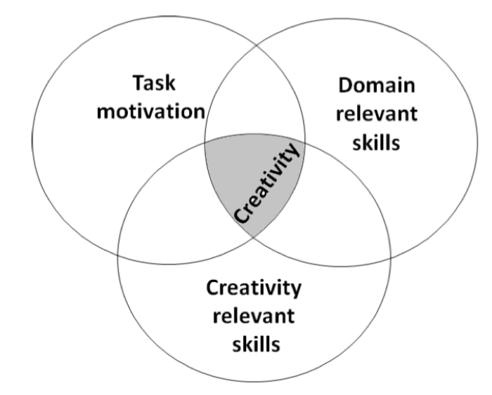
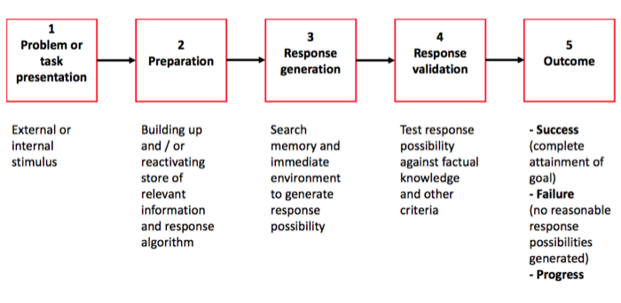
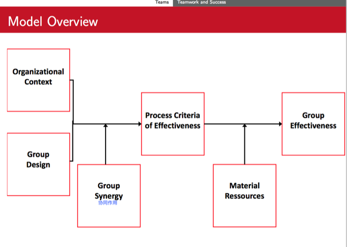

#Human side of Innovation - Preparing the final test

##Possible Elements in the Exam

###Creativity

####>>>SUMMARY

- Introduction and definition
    - Definition of creativity
    - Ways to measure creativity
- Amabile’s theory on creativity
    - 3 components (domain-relevant skills, creativity-relevant skills, task
motivation) and their effects on 5 phases of creativity
    - Effects of organizational work environment on motivation and creativity
- Brainstorming
    - Understand brainstorming problems and possible solutions
- Discussion of empirical studies on creativity 
    -  Several factors influence creativity
    - Importance of interaction effects

#### >>>Measurement of creativity: Via behavior in context vs via personality scales.**Discuss Advantages / Disadvantages**
  
**Difference of Innovation and Creativity**

Creativity:

- Generation of novel and useful ideas 
- Absolute (”true”) novelty
- Partially an intra-individual (自我节点内的) cognitive process
  

Innovation:

- Production of creative ideas and implementation 
- Relative novelty (e.g., ideas may be adopted from otherorganizations)
- Primarily an inter-individual(人与人之间的) social process

**Measurement of creativity**

Three Components of Creativity (Amabile, 1996a)

Componential theory: 3 main creativity facilitators (= components)

1. Domain-relevant skills (factual knowledge, skills and experience in a specific
field)
2. Creativity-relevant skills (e.g., innovative cognitive style, knowledge of
techniques to produce creative ideas)
3. Task motivation (intrinsic and extrinsic)

Creativity intersection: *Highest creativity when an individual is high in all three components!*

#### >>>Amabile’s model on creativity: remember the example we discussed (MIT,Amazon Kindle)

**Amabile’s model on creativity**

**Positive Organizational Influence**

- Increase intrinsic motivation
:
	- Freedom & autonomy
	- Give optimal challenge
	- Assign tasks to match interests

- Increase extrinsic motivation
	- Confirm competence through recognition
	- Give a clear strategic direction
	- Provide sufficient resources

- Diminish demotivational extrinsic factors
	- Do less surveillance and establish fewer rigid procedures
	- Reduce expectation of too critical evaluation
	- Give realistic deadlines

- Domain-relevant skills
	- Provide training in relevant factors 
	- Provide support for critical success factors 
	- Assign tasks to match skills

- Creativity-relevant skills
	- Encourage unconventional thinking 
	- Support alternative solutions
	- Give time to fully capture situations and problems

**Analyzing the mini case of Kindle**


Please discuss the creative process behind this development based on Amabile’s model of creativity.

> TODO: 我要自己试着用前面的model和这些positive的行为来分析
> 后面也有一些经验的结论, 这些好像也和这个minicase 相关

#### >>>Brainstorming!

> TODO: 主要是说brainstorm的问题什么的

**What is Brainstorming?**

Brainstorming is a method of group problem solving

**Possible Threats**

- Production blocking
  - No uninterrupted flow of thought possible
  - Only one person can speak at one time
  - While others’ speak, one’ own idea production is blocked or ideas are being forgotten
- Social loafing
  - Participants may not work as hard as they would alone, especially if they perceive their contribution to be unidentifiable
- Evaluation anxiety and conformity
  - Fear that others may negatively evaluate one’s ideas
  - Members may communicate traditional or similar ideas to ”fit in” and not to diverge from others
- Downward norm setting
  - Performance across group members often converges
  - Brainstorming participants sometimes tend to match their performance to that of the least productive members)

**Better method:**

BrainWriting


- Nominal group technique (sharing and discussing ideas after independently
writing them down) 
- Electronic brainstorming (individual computer stations to type in ideas, while all or a sample of all ideas are projected on the wall or shown in a separate window on the computer screen)
- Diversification of the team (e.g. regarding training) and membership change (exit of old member and entry of new member)
- Trained facilitators minimize some threats, e.g. ensure that only the ideas themselves and not anecdotes are communicated

BrainWarming

In brainwarming graph, the goal grows downward into refined subgoals. 

Resoureces are interacted together and grow upward. 

When the two directions connect, solutions start to emerge.

####>>>Discussion of Empirical Studies on Creativity

#####The Impact of Mood on Creativity
Positive mood facilitates creative thinking

- Daily positive mood positively predicted daily creative thought (judged by expert raters) on the same day and with a 1-2 day delay
- Aggregated monthly positive mood positively predicted monthly coworker- rated creativity
- Most creative incidents (86%) associated with positive emotional reactions

But there are also opposing results:

- Negative mood positive for creativity if organization recognizes and rewards creativity (George and Zhou, 2002)

#####Motivation, Bureaucracy and Creativity

Situational influences (higher-level team climate factors) may weaken or strengthen the effect of individual differences
→ **Person-in-situation theory**

研究雇员motivation和组织架构的关系

- Employee motivation was studied using 3 types of goal orientations
	- **Learning orientation** (sample item: I often look for opportunities to develop new skills and knowledge)
  	- **Performance prove orientation** (sample item: I’m concerned with showing that I can perform better than my co-workers)
  	- **Performance avoidance orientation** (sample item: I’m concerned about taking on a task at work if my performance would reveal that I had low ability)

- 2 bureaucracy factors
  	- Centralization: 
  		- How is power distributed in an organizational hierarchy? 
  		- Is there a chain of command? 
  		- Are employees encouraged to participate in decision making
  		- Sample item: The team leader uses my work group’s suggestions to make decisions that affect us
  	- Formalization: 
  		- Which rules are clearly specified, which procedures standardized? 
  		- Sample item: Our work involves a great deal of paperwork and administrations

RELATIONSHIP:

- **Performance avoidance orientation** had a negative relation with creativity (consistent with the notion that this orientation disposes individuals to be less creative because of risk of failure and the possibility of appearing incompetent)

- Employees’ **performance prove orientation** was positively related to creativity when formalization was low, but not when it was high

- When centralization was low
  	- **learning orientation** was positively related to creativity
  	- **performance avoidance orientation** was less negatively related to creativity   

- When formalization was low
  - performance prove orientation was positively related to creativity (see next slide)   
  - performance avoidance orientation was more negatively related to creativity

RESULT:

- To get creative results, managers should seek to understand employees’ **motivational orientations in context**, so the combination of individual disposition and bureaucratic context yields the most desirable *associations with creativity*.
- **Decentralization** brings out the best in learning-oriented employees and attenuates the negative of an avoid orientation on creativity. Thus, from a creativity perspective, decentralized decision making is attractive, *even when it does little for prove-oriented individuals*.
- **Formalized practices are a more complex issue**. Although the creativity of prove-oriented individuals thrives in less formalized contexts, *low formalization actually brings out undesirable tendencies in avoid-oriented team members*
- ”The conclusion would be that creativity is **best obtained** by (where possible) **not selecting avoid-oriented individuals **for a team, while creating a team context characterized by **high levels of decentralized decision** making and **low formalization**, to let learning-oriented and prove-oriented individuals flourish.” (p. 638)

#####When Job Dissatisfaction Leads to Creativity

What is job dissatisfaction:

- Reactions to job dissatisfaction
  - Exit: Leave the company (**active**, **destructive** reaction)
  - Neglect: Lower effort (**passive** reaction)
  - Loyalty: Accept status quo (**passive** reaction)
  - Voice: Do something about it (**active**, **constructive** reaction)

How to measure it:

- Creativity:
	- 13 item scale (such as ”Person suggest new ways to achieve goals or objectives”)
- **Job dissatisfaction**:
    - 3 item scale (such as ”In general I like working at this company”; ”In general, I like my job”)
- **Continuance commitment**:
    - 6 item scale (such as ”Right now, staying with this company is a matter of necessity as much as desire”)
- Useful feedback from coworkers:
    - 3 item scale (such as ”I find the feedback I receive from my coworkers very useful”)
- Coworker helping and support:
    - 4 item scale (such as ”We help each other out if someone falls behind in their work”)
- Perceived organizational support for creativity:
    - 4 item scale (such as ”Creativity is encouraged at this company”; ”The reward system encourages innovation”)

RESULT:

- Implications
    - Job dissatisfaction is not necessarily undesirable for organizations
    - Managers should (of course) not try to increase job dissatisfaction, but try to create a suitable work environment that even in this unfavorable situation positive results are possible
⇒ Positive effect on worker and organization possible
-  Critique and Further Research
    - Dyadic data: Biased responses minimized
    - Cross-sectional study: Difficult to assess causality
    - What are the effects of creative behavior in response to job dissatisfaction?
    - What is the effect of individual characteristics of workers on the analyzed
hypotheses (e.g. self-esteem)?

---

###Teams

#### Given Situation / task: Describe how a team can be useful in such a situation: Discuss positive factors (such as complementarities, specialisation, knowledgetransfer) as well a negative effects (such as free riding, coordination effort)

> TODO:我觉得不应该就这么点吧...每个优缺点就一句话? 

#####Advantages
**Complementarities:**

The task can be done faster / more e ciently with more people

**Specialisation**

Each team member may concentrate on a certain task and fulfill this task better, e.g. due to learning effects

**Knowledge transfer**

Team members possess idiosyncratic knowledge, which is helpful for other team members

#####disadvantages

Free-Riding problem

Coordination effort

####Teamwork and success (hackman model): Similar question as above (Amabile) possible

###Interactive value creation

####2 fundamental problems of innovation: Discuss in context

####One specific method: mini case

####Community management