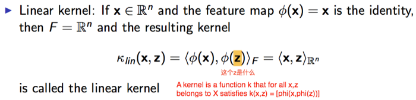
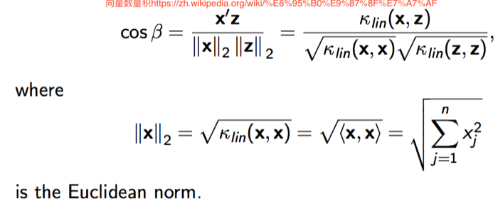
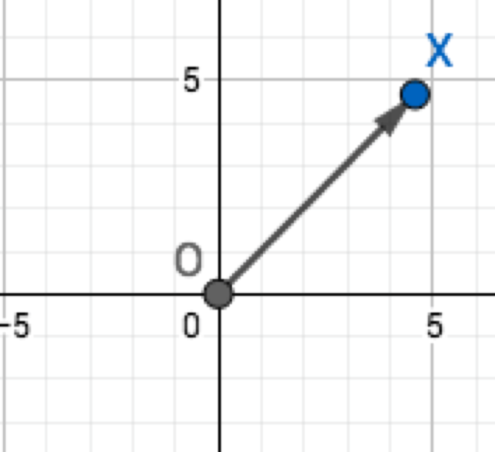
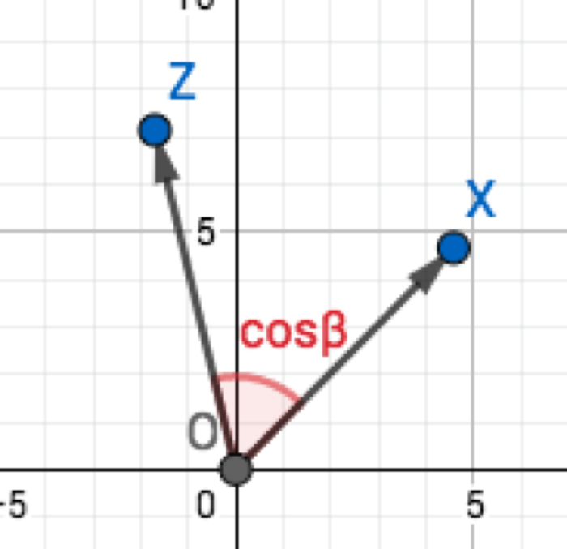
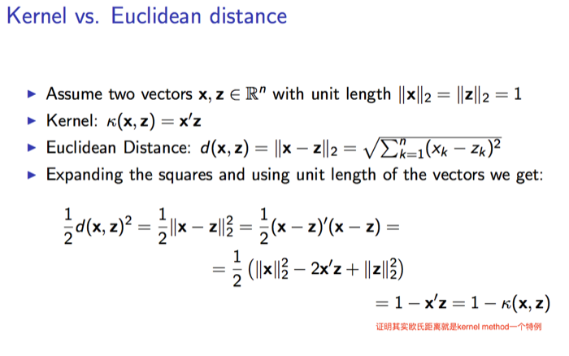
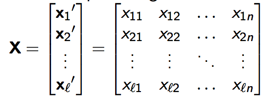
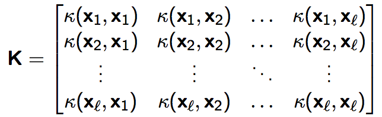
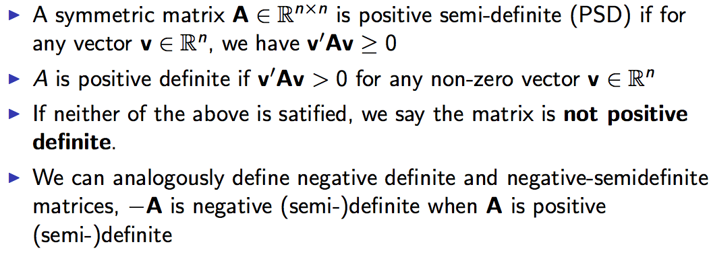

# Kernel Method in Machine Learning

> I can also render TeX-like math syntaxes, if you allow me to. I can do inline math like this: \( 1 + 1 \) or this (in MathML): <math><mn>1</mn><mo>+</mo><mn>1</mn></math>, and block math:
> 
> \[
>    A^T_S = B
> \]

## How to learn it

1. attend the class on time.
2. review the slides, make notes
3. do the homework, make some complementary notes

## Introduction (16.09.2017)

### What is kernel

Informally, a kernel is a function that calculates the similarity between two objects.

> 计算两个object相似性的东西就是kernel

### Data and Feature maps ###

1. Assume the a piece of data \( x \) from a `data set` \( X \)
2. The `data set` can be projected to a new space, \( F \)
3. The mapping function of last step (project X into F) called \( \phi : X \longmapsto F \)
4. For \( x \), we can derive the procedure of projecting \( x \) to \(F\) as \( \phi (x)\)

> Remeber \(\phi(x)\) is the projection to a new higher space \( F \) !!!

### Kernel function ###

#### Defination ####

a kernel function is an inner product (scalar product, dot product) **in the feature space F**,
denoted by \( \langle·,·\rangle_F \)

> Watch out, the kernel function is in the FEATURE SPACE \( F\)

#### Linear kernel: 

Why do we call it linear kernel? What is the difference between it and other kernels?

The main reason is \( \phi(x) = x \) , this equation ensure the kernel function is linear.

> What is \(z\) of \(\phi(z)\) ? 
> 
> It is another piece of data from input data set \( X \), just like \( x \)

Therefore we can get the expression of Linear Kernel

\[
	\kappa_{lin}(x,z) = \sum_{j=1}^nx_jz_j = x'z
\]

> x' = transpose of vector x

#### Geometric interpretation of kernel function

Geometric interpretation of the linear kernel: **cosine angle between two feature vectors**

----

> \>>>> Content below is just my understanding, I still have confusion about this geometric interpretation things

Let's try to understand it!

from the equation, we know that the kernel function 
\(\kappa_{lin}(x,z) =  x'z = cos\beta * Constant \), in this equation the \(Constant = ||x||_2||z||_2\). 

So the linear kernel function has linear relationship with the angle \(cos\beta\), which means we can use the angle
between two vectors to represent the linear kernel function. Each vector is the line between original point and the 
data point

For example, the vector of \( x \) is like below:

So we can use the angle \(cos\beta\) to represent the linear kernel function \( \kappa_{lin}(x,z)\)

This explaination will be used in next few sections.

> <<<< end of my notes

----

#### Kernel vs. Euclidean distance

#### Hilbert space

not be examined, pass

#### Data & kernel matrix

**Suppose we have a serial of data \(\{x_1,x_2,x_3,....,x_n\}\), 
each of them has different some feature(dimension).**

For example, \( x_1 = (x_{11}, x_{12},x_{13},...,x_{1n})\)

We can build a data matrix with those data:

*In contrast to that*, we can form the kernel matrix by simply caculate the dot product of two data matix. 
I just **multiply the data set with itself**. Here is the result:

Obviously, each entry is an inner product between two data points 
\(\kappa(x_i,x_j) = \langle\phi(x_i),\phi(x_j)\rangle\), 
remeber \(\phi\) is the projection from data set X to the higher space F 

**improtant properties**

- Since an inner product is symmetric K is a symmetric matrix
- K is positive semi-definite --> eigenvalue is non-negative

> *What is "positive semi-definite"*
>
> 
>
> **and wikipedia helps a lot [Positive-definite kernel](https://en.wikipedia.org/wiki/Positive-definite_kernel)**
>
> Eigenvalues of a PSD ("positive semi-definite") matrix is non-negative, 
> 
> For a positive define matrix, eigenvalues will not equals to 0, only larger than 0

----

