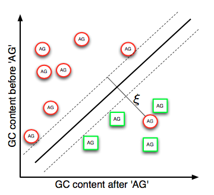

# Kernel Method in Machine Learning

> I can also render TeX-like math syntaxes, if you allow me to. I can do inline math like this: \( 1 + 1 \) or this (in MathML): <math><mn>1</mn><mo>+</mo><mn>1</mn></math>, and block math:
> 
> \[
>    A^T_S = B
> \]

## How to learn it

1. attend the class on time.
2. review the slides, make notes
3. do the homework, make some complementary notes

## Introduction (16.09.2017)

### What is kernel

Informally, a kernel is a function that calculates the similarity between two objects.

> 计算两个object相似性的东西就是kernel

### Data and Feature maps ###

1. Assume the a piece of data \( x \) from a `data set` \( X \)
2. The `data set` can be projected to a new space, \( F \)
3. The mapping function of last step (project X into F) called \( \phi : X \longmapsto F \)
4. For \( x \), we can derive the procedure of projecting \( x \) to \(F\) as \( \phi (x)\)

> Remeber \(\phi(x)\) is the projection to a new higher space \( F \) !!!

### Kernel function ###

#### Defination ####

a kernel function is an inner product (scalar product, dot product) **in the feature space F**,
denoted by \( \langle·,·\rangle_F \)

> Watch out, the kernel function is in the FEATURE SPACE \( F\)

#### Linear kernel: 

Why do we call it linear kernel? What is the difference between it and other kernels?

The main reason is \( \phi(x) = x \) , this equation ensure the kernel function is linear.

> What is \(z\) of \(\phi(z)\) ? 
> 
> It is another piece of data from input data set \( X \), just like \( x \)

Therefore we can get the expression of Linear Kernel

\[
	\kappa_{lin}(x,z) = \sum_{j=1}^nx_jz_j = x'z
\]

> x' = transpose of vector x

#### Geometric interpretation of kernel function

Geometric interpretation of the linear kernel: **cosine angle between two feature vectors**

----

> \>>>> Content below is just my understanding, I still have confusion about this geometric interpretation things

Let's try to understand it!

from the equation, we know that the kernel function 
\(\kappa_{lin}(x,z) =  x'z = cos\beta * Constant \), in this equation the \(Constant = ||x||_2||z||_2\). 

So the linear kernel function has linear relationship with the angle \(cos\beta\), which means we can use the angle
between two vectors to represent the linear kernel function. Each vector is the line between original point and the 
data point

For example, the vector of \( x \) is like below:

So we can use the angle \(cos\beta\) to represent the linear kernel function \( \kappa_{lin}(x,z)\)

This explaination will be used in next few sections.

> <<<< end of my notes

----

#### Kernel vs. Euclidean distance

#### Hilbert space

not be examined, pass

#### Data & kernel matrix

**Suppose we have a serial of data \(\{x_1,x_2,x_3,....,x_n\}\), 
each of them has different some feature(dimension).**

For example, \( x_1 = (x_{11}, x_{12},x_{13},...,x_{1n})\)

We can build a data matrix with those data:

*In contrast to that*, we can form the kernel matrix by simply caculate the dot product of two data matix. 
I just **multiply the data set with itself**. Here is the result:

Obviously, each entry is an inner product between two data points 
\(\kappa(x_i,x_j) = \langle\phi(x_i),\phi(x_j)\rangle\), 
remeber \(\phi\) is the projection from data set X to the higher space F 

**improtant properties**

- Since an inner product is symmetric K is a symmetric matrix
- K is positive semi-definite --> eigenvalue is non-negative

> *What is "positive semi-definite"*
>
> 
>
> **and wikipedia helps a lot [Positive-definite kernel](https://en.wikipedia.org/wiki/Positive-definite_kernel)**
>
> Eigenvalues of a PSD ("positive semi-definite") matrix is non-negative, 
> 
> For a positive define matrix, eigenvalues will not equals to 0, only larger than 0

----

## Regularized learning and kernels (22.09.2017)

### Linear models

My understanding of "\(g(x)\) gives the distance of the orthogonal projection of x onto \(w/||w||\) from the hyperplane." is below:

### Loss functions: Hinge loss

Hinge loss:
\[
	\sum_{i=1}^lL_{Hinge} (g(x_i),y_i) = \sum_{i=1}^l max(0, 1-y_ig(x_i))
\]

> This function is the same function mentioned by Andrew Ng in his Machine learning course, I finally knew the name of it.

### How to maximize the Margin 

Spent some time for understanding this thing. 

The reason of maximize the Margin is abvious, following is two boundaries for a same data set, the right one (who has a large margin) have better performance and robustness.

Hwo to maximize it? Let's do this step by step.

#### Step 1: Overview

#### Step 2: Where is the margin

The best margin is the vector \(\gamma\) (yellow one, from point V to point E).

The math equation of \(\gamma\) is:

\[
	\gamma(x) = yg(x) = y(\langle \omega,x \rangle + b)
\]

\( \langle \omega,x \rangle\) is the inner product of two vectors, we can represent it as the projection on the direction of \(\omega\) times the lengh \(\omega\). On the diagram, the line \(OR\) and \(BR\) are two example of \( \langle \omega,x \rangle\)

#### Step 3: If the lengh of \(\omega\) is fixed

Becasue \(\omega\) is a direction, so we can make a hyphothesis that the lengh of \(\omega\) is fixed, \(||\omega|| = 1\).

**From above we can know that the main task of ours is to caculate distance of each data point and then find the best one, for whom all data points have larger or equal distance to the boundary.**
(Actually we are finding the nearest point to the boundary line, I used those words for better understanding of following equations)

Math language:

\[
	Maximize \ \gamma,   \\
	Subject \ to         \\
	y_i(\langle \omega,x \rangle + b) \ge \gamma \\
	(for \ all \ i =1,...,l ; ||w|| = 1)
\]

#### Step 4: Change the view, if lengh of \(\gamma\) is fixed

It is not hard to understand, from the view of vector caculation. We simply have:  

\[
	||\gamma||= ||\omega||  \times ||x||cos\beta \\
	||x||cos\beta = \frac{||\gamma||}{||\omega||}
\]

If we assume \(\gamma\) is fixed too. How do we find the nearest point to the boundary(which means having the smallest distance \(||x||cos\beta\))?

Answer is obviously, find the max \(\omega\).

In math:

\[
	Minimize \ \frac12||\omega||^2,   \\
	Subject \ to         \\
	y_i(\langle \omega,x \rangle + b) \ge 1 \\
	1 -y_i(\langle \omega,x \rangle + b) \le 0 \\
	(for \ all \ i =1,...,l ; )
\]

Recall the Hinge loss function:

\[
	\sum_{i=1}^lL_{Hinge} (g(x_i),y_i) = \sum_{i=1}^l max(0, 1-y_ig(x_i))
\]

We can treat \(g(x) = \langle \omega,x \rangle + b\), and got this:

\[
	Minimize \ \frac12||\omega||^2,   \\
	Subject \ to         \\
	L_{Hinge} ((\langle \omega,x \rangle + b),y_i)  \le 0 \\
	(for \ all \ i =1,...,l ; )
\]

Perfect! We got a constraint for our algorithm, by using this constraint we can create the margin.

> Teacher said that he will talk about how to use this constraint in the regression procedure.

#### Step 5: Tolerance of Non-separable data 

It is very common that the data set is not extreamely divided. For example:

We should introduce a soft-margin SVM to fix this problem.

First, let's take a look at the math equation:

\[
	Minimize \ \frac12||\omega||^2+C\sum_{i=1}^l \xi_i,   \\
	Subject \ to         \\
	1 -y_i(\langle \omega,x \rangle + b) \le \xi_i \\
	(for \ all \ i =1,...,l ; \xi_i \ge 0)
\]

\(\xi_i\) is called slack variable, when positive, the margin \(\gamma(x_i) < 1\)

I think that the **key** for this soft-margin is that we added an item \(C\sum_{i=1}^l \xi_i\) after \(\frac12||\omega||^2\), which means that **we are not only looking for a minimum \(\omega\) but at the same time, in this position of \(\omega\) the sum of \(\xi\) is smallest**.

I drew a diagram for visualization:

There are two things to be understood: 

1. The \(\xi_i\) of equation \( 1 -y_i(\langle \omega,x \rangle + b) \le \xi_i\)
2. \(C\sum_{i=1}^l \xi_i\)

**For the first problem**, it is quite easy but confused me for a long time. [An answer on StackExchange](https://stats.stackexchange.com/a/246490) gave me a hint for understanding it.

>Note that this is a "logical" approach and less a geometric one. Indeed, the value 11 enforces a scaling for the problem. 
>For a geometric perspective, consider two hyper-planes \(w_1\) and \(w_2\) such that \(w_2=Dw_1\) for some positive constant \(D\). Clearly, \(w_2\) makes the exact same +/- decisions as \(w_1\), however evaluating \(w_2\) vs \(w_1\) would require factoring in that \(D\) scaling. Thus, there needs to be some way in which we "lock down" the scaling, we could have similarly required that \(||w||=1\) and then **have \(\gamma −\xi_i\) and** seek to ~~minimize \(-\gamma+C\Sigma\xi_i\)~~ (I think this equation is not right).

It is a good idea to return back to the **Step 3**. Where we have this:

\[
	y_i(\langle \omega,x \rangle + b) \ge \gamma \\
\]

Let's add the slack variable, 

\[
	y_i(\langle \omega,x \rangle + b) \ge \gamma - \xi_i \\
	y_i(\langle \omega,x \rangle + b) + \xi_i \ge \gamma \\
\]

We knew that \(y_i(\langle \omega,x \rangle + b)\) is the distance of a point to the boundary. For a misclassified point, how to get the same distance with correct point? The answer is adding a bias.

In the diagram above we have a misclassified point \(W\), the purple vector \(OA_1 = \langle \omega,x \rangle + b\) is the distance between \(W\) and the ideal boundary and the slack variable \(\xi_i\) is the pink dot line. You can easily see that \(OA_1 - \xi_i = \gamma\).

From this part, we can always ignore any misclassified points, but it is not enough. Because if we just simply ignore every misclassified points we can randomly draw a boundary and it will always satisfy our constrant (think about drawing a boundary between \(B\) and \(D\). This is a obviously bad boundary, but it still satisfy the equation \(y_i(\langle \omega,x \rangle + b) \ge \gamma - \xi_i\)).

**For the second point**, we are going to fix the issue mentioned above.

Because the misclassified points is minority, so if we chose a boundary that close to the misclassified point, the item \(C\sum_{i=1}^l \xi_i\) will be significantly large. So we can only get \(min(\frac12||\omega||^2+C\sum_{i=1}^l \xi_i)\) by choosing a boundary that close to the major data points.

If \(C\) is large, which means we value the misclassification a lot, we cannot tolerant them. So it may lead to a overfit issue.

But if \(C\) is small, which means we don't care about the misclassification. Image that if \(C=0\), any boundary will satisfy our equation. Underfitting happends.

