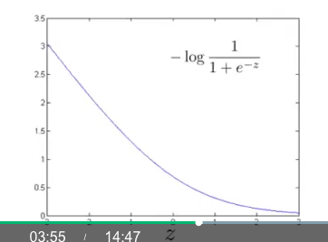
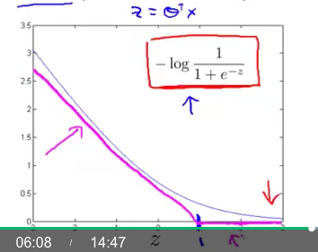

# Machine Learning Basic Note

## Understanding SVM

Based on Andrew Ng's Machine Learning Basic.

SVM is a kind of optimization of Linear Regression. 

In Linear Regression, we trying to minimize the error function:

\[
min(\xi = \sum_{i=1}^my^{(i)}\bigg( -\log h_\theta(x^{(i)}) \bigg) + (1-y^{(i)})\bigg( -\log (1 - h_\theta(x^{(i)})) \bigg)+ \frac\lambda{2m}\sum_{j=1}^n\theta_j^2) 
\]

in the function above, \(-\log h_\theta(x^{(i)})\) and \(-\log (1 - h_\theta(x^{(i)}))\) are called cost function, which used to measure the distant between prediction result and actual result.

Because we use `sigmoid` function for you prediction, so the curve of \(-\log h_\theta(x^{(i)})\)
looks like this: 

We use a two linear function to describe that curve roughly:

And we call this new cost function \( Cost_0(\theta^Tx)\)

**According to the cost function \( Cost_0(\theta^Tx)\), if we want to minimize the it, we should have \(\theta^Tx \ge 1\)**

(in the case of the result \( y = 1\)) 

(Minimizing the cost function \( Cost_0(\theta^Tx)\) will minimize the Error function \(\xi\) too)

So we can get a important restriction: 
 \[
     \theta^Tx \ge 1
\]

This restriction makes the data points which far away from the boundary have the influence of angle of the linear boundary. In other words, which means we can have a margin for the boundary.

How to modify the margin? 

From my understanding, we can rewrite the restriction as this: 
\[
    \pmb{\theta x'} \ge C (C = Constants)
\]

Where the \(\pmb x'\) is the projection of \(\pmb x\) on the direction of \(\pmb \theta \), \(\pmb x = ||x|| * cos\beta\)

So we have 
\[
 \pmb \theta \ge \frac{C}{\pmb x'}    
\]

The factor \(C\) will influence the angle theta.

> The key step is using a discrete function to replace a continous function, which made the \(C \ne 0\)

## Somewords of Kernel Methods

The course of Andrew Ng is good!

I have been confused what is Kernel and how to understanding the Kernel in a more intuitive way. Before I studying his course I always need to recall a lot of conceptions and try to remember it in a hard way.

The example of him is to describe the `Kernel function` as a tool of checking the similarity of two points.

So who is our standard? The answer is quite simple but it costs me some time to realize it. `Training set` is our standard for comparing the similarity. In Andrew's course, he called it as "landmark".

When **a new data** from `Testing set` comes in, we will use `Kernel function` to check if the new data similar with each "landmark". As the result of comparing, it will save the result in a column vector.

As for the whole data set, we can derive a matrix from `Testing set`, which is called `Kernel Matrix`.

> The size of `Kernel Matrix`: 
>
> Suppose that we have a training set \(X_{training} \in R^{m_1 \times n}\), where \(m_1\) is the number of data, \(n\) is the number of features, or dimesions. The test data set is \(X_{testing} \in R^{m_2 \times n}\)
>
> So for the Kernel Matrix: \(K \in R^{m_1 \times m_2}\)

The `Kernel function` is a projection of a data set, from which we can project the data to a feature space, in that space we can use Linear classifier for classification problem.  

## Combination of SVM and Kernel Method

They are two seperated things, SVM is a classfier that have better performance than normal linear classifier.

Kernel is a good method that will reduce the computation complex when implementing the classifier. 

For my understanding, SVM is a engine in a car and Kernel is the N2O Booster.

