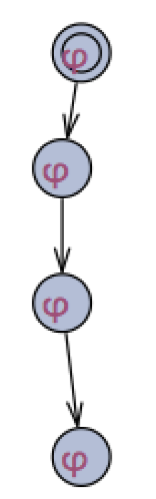

#Quanlity Assurance Note 3 - Model Checking for CTL

QES笔记3

##前情提要##

前两篇的笔记讲的是怎么用形式化的语言来表述一个系统, Kripke Structure更多的是倾向于单任务的, 无时序的系统的描述.

而Timed automata就是在此之上为我们提供了描述时序和多任务系统的方法. 最后, 我们发现其实Timed automata这种无限状态机也可以转换为有限的Kripke Structure, 这样的归化为之后的分析带来了极大的方便. 这样我们就可以只用专注于自动化的分析Kripke Structure这件事儿就行了, 不必分心于考虑时序和多任务的情况.


##简介##

每一节一定先要把目标确定好, 这样才能知其所以然. 

这一节的首要目标是: 既然我们已经知道了怎么描述一个系统(Kripke Structure), 也知道了怎么取形式化的描述需求(LTL和CTL), 那我们需要用某一种可以被计算机理解和执行的方法去让计算机验证我们的系统是否满足需求.

在这一节里面,我们讨论的主题是CTL, 因为它更加常用: 

1. CTL的Labeling Algorithm是什么, 怎么使用
2. 怎么利用SAT(Boolean Satisfiability)算法来找到在哪个具体的状态上满足CTL的描述

##Labeling Algorithm##

###1. CTL的性质

之前我们提到CTL有许多描述符, 但是越多的描述符虽然越容易让人类理解, 但是对于计算机来说, 无形中会多出了许多case. 

其实对于CTL来说, 只要有满足一下条件的描述符的集合, 就足够了:

1. {AX, EX}至少有一个
2. {EG, AF, AU} 至少有一个
3. 必须含有EU (Exist ... Until..)

比如说 `{¬, ∧, EX, EG, EU}`就是一个在功能上完备的描述符合集, 其他的所有描述符都能用这5个基本描述符描述

下面就是如何用这5个描述符展开其他描述符的公式, 可以看看

```
φ ∨ ψ ≡ ¬(¬φ ∧ ¬ψ) 
EF φ ≡ E[true U φ] 
     ≡  φ ∨ (true ∧ EX E[true U φ]) 
     ≡  φ ∨  EX E[true U φ] 
     ≡  φ ∨  EX EF φ
AG φ ≡ ¬ EF ¬φ 
AF φ ≡ ¬ EG ¬φ
AX φ ≡ ¬ EX ¬φ 

```

这其中, AF, EG, EF 和 EU 可以用AX和EX的递归式来定义

```
EG φ ≡ φ ∧ EX EG φ
AF φ ≡ φ ∨ AX AF φ
EF φ ≡  φ ∨  EX EF φ
E[φ U ψ] ≡ ψ ∨ (φ ∧ EX E[φ U ψ]) 
```

这里有伏笔, 过会儿说的SAT算法的时候要用到这几个递归式


###2. Labeling Algorithm


这个算法的目标是: 判断在所有的状态中是否满足CTL表达式

这个算法主要的方法是先替换, 再筛选. 一步步验证状态是否满足.

**首先**, 我们需要把一个CTL表达式利用CTL的性质转换成用`{¬, ∧, EX, EG, EU}`描述的CTL表达式

下面来详述分别在不同情况下怎么应用 Labeling Algorithm

1. 如果状态s中存在`φ`(`φ`是原子命题,例如说a=5),那就给状态s标记一个`φ`
2. 如果状态中同时存在`φ1`和`φ2`, 那么就给状态标记`φ1∧φ2`
3. 如果状态中不存在`φ`,那么就给状态标记`¬φ`
4. 对于`AFφ`标记方法如下:
	1. 先把所有标记为`φ`的状态标记为`AFφ`
	

	2. 如果一个状态的所有子状态被标记为了`AFφ`那么也把这个状态标记为`AFφ`; 一直重复这一步直到各个状态上面的label没有变化
	
5. 对于`E[φ1Uφ2]`
	1. 先把所有被标记为`φ2`的状态标记为`E[φ1Uφ2]`
	

	2. 如果一个状态被标记为`φ1`, 且它的子状态中有`E[φ1Uφ2]`, 那么就把它标记为`E[φ1Uφ2]`; 一直重复这一步直到各个状态上面的label没有变化
	
6. 如果一个状态拥有一个`φ`的子状态,那么就可以给他标记上`EXφ`
	

7.  对于`EGφ`
	1. 先把所有标记为`φ`的状态标记为`EGφ`
	2. 如果一个被标记为`EGφ`的状态, 它的子状态都不存在`EGφ`,那么就把它身上的标记删掉; 一直重复这一步直到各个状态上面的label没有变化
	


其实Labeling Algorithm可以让我们在一个比较高的抽象层级上面来检验一个Kripke Structure是否满足CTL表达式, 但是具体到实现上, 就需要一个为实际问题定制的算法, 也就是SAT算法, 它可以看做是Labeling Algorithm的特别定制版

##SAT(Boolean Satisfiability)算法##

###用布尔方程(Boolean formula)表示Kripke Structure

我们已经知道每个状态上只可能存在, 或者不存在原子命题`φ`, 所以我们就可以用布尔值1或者0来表示"存在`φ`"或者"不存在`φ`".

但是transition, 也就是状态之间的转换怎么表示呢.

在这里我们用`∧`来表示两个状态之间的跳转

举个例子, 有下图这样的Kripke Structure


它有两个状态, 分别是:`s1=a∧b,s2=a∧¬b`

那从`s1`到`s2`的transition就是: `(a ∧ b) ∧ (a' ∧ ¬b')`


所以整个Kripke Structure就可以这样描述:

`(a∧b ∧ a'∧b')∨(a∧¬b ∧ a'∧¬b')∨(a∧¬b ∧ a'∧¬b')∨(a∧¬b ∧ a'∧b')`

>这一段感觉讲的没什么道理, 因为布尔方程的"目的"我也还不是很清楚...


###SAT算法 (fixed point algorithm)


感觉这个SAT算法是一个比较深的东西, 在这里我只说一下他是怎么在model checking里面得到应用的. 详细的东西还是先详细学习了以后才能了解.


SAT算法提供了一个验证CTL表达式的方法, 我一直很想把它和之前的labeling algorithm连起来, 因为他们是在有许多相似之处. 但是总觉得有些地方解释不通, 所以也不敢妄下结论. 

这个算法里面的基本知识是要理解`SAT(EX Z)` 这个运算.

`SAT`是satisfy的简写, 输入是一个CTL表达式, 输出是满足这个表达式的状态的集合.

举例:

`SAT(φ)` 就是图里所有存在`φ`的状态的合集

`SAT(EX φ)`就是图里所有子状态存在`φ`的合集*(这里要注意, 不一定要所有的子状态都是`φ`, 只要有一个子状态有`φ`就行)*


前面在**"CTL性质"**这一小节里面, 我们有提到了, CTL里面最基本的几个表达式

>`{¬, ∧, EX, EG, EU}`就是一个在功能上完备的描述符合集, 其他的所有描述符都能用这5个基本描述符描述

而`EX` 又是一个很简单明了的描述符, 所以我们只需要了解`EG`和`EU`就好, 但是为了方便起见, 我们先谈`EG`和`EF`这两个用的比较多又有代表性的描述符

####EG φ

```
//求EG φ
Z:= SAT(φ)
	do
		Z := Z ∧ SAT(EX Z); //注意这里是取交集
	until nothing changes in Z
return Z

```

名词解释:

`Z`: 一个变量,可以视为一个数组,用来存储状态的集合

`SAT(φ)`: 所有存在`φ`的状态的集合

`Z:= Z ∧ SAT(EX Z)`: 分三步理解

1. 找到当前的`Z`所存储的状态集合, 第一次的进入循环的时候`Z:=SAT(φ)`.
2. 找到所有`Z`中状态的父状态的集合, 因为这些状态都满足`EX Z`
3. 对1. 和2. 中的两个集合求交集.


当Z中的元素不再变化时, 我们就能找到所有满足`EG φ`的合集

此时到达**greatest fixed point**

> 这里有个问题, 就是SAT算法其实是找到了一个循环. 如果是一个所有状态都存在`φ`的线性的树状图, 图内没有任何循环, 那么当循环到初始状态(S0状态)的时候, 此时`Z={S0}`, `EX Z=∅`. 最后得到的结果也是空集(`∅`), 根据SAT算法, 那么我们会得出这个图并不满足`EG φ`的结论, 这明显不符合. 
> 
> 我说的是这样的:
> 
> 


####EF φ

```
//求EF φ
Z:= SAT(φ)
	do
		Z := Z ∨ SAT(EX Z); //注意这里是取并集
	until nothing changes in Z
return Z

```

`EF φ`和`EG φ`的区别就是取的是并集, 所以当到达fixed point 的时候, 此时为 **least fixed point**


#####E[φ U ψ] ≡ ψ ∨ (φ ∧ EX E[φ U ψ])

```
//求E[φ U ψ]
Z:= SAT(ψ)
	do
		Z := Z ∨ (SAT(φ) ∧ SAT(EX Z)); //注意这里是取并集
	until nothing changes in Z
return Z

```

---


这一期就到这里啦! 生硬的结尾, 写的实在有点焦躁, 这块知识还是不是理解的很透彻呀.

