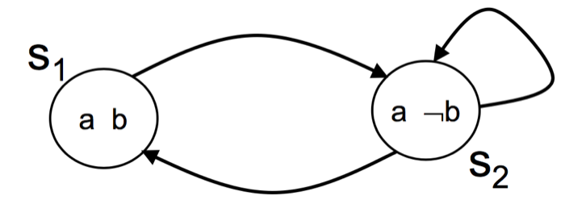

#Quanlity Assurance Note 3 - Model Checking for CTL

QES笔记3

##前情提要##

前两篇的笔记讲的是怎么用形式化的语言来表述一个系统, Kripke Structure更多的是倾向于单任务的, 无时序的系统的描述.

而Timed automata就是在此之上为我们提供了描述时序和多任务系统的方法. 最后, 我们发现其实Timed automata这种无限状态机也可以转换为有限的Kripke Structure, 这样的归化为之后的分析带来了极大的方便. 这样我们就可以只用专注于自动化的分析Kripke Structure这件事儿就行了, 不必分心于考虑时序和多任务的情况.


##简介##

每一节一定先要把目标确定好, 这样才能知其所以然. 

这一节的首要目标是: 既然我们已经知道了怎么描述一个系统(Kripke Structure), 也知道了怎么取形式化的描述需求(LTL和CTL), 那我们需要用某一种可以被计算机理解和执行的方法去让计算机验证我们的系统是否满足需求.

在这一节里面,我们讨论的主题是CTL, 因为它更加常用: 

1. CTL的Labeling Algorithm是什么, 怎么使用
2. 怎么利用SAT(Boolean Satisfiability)算法来找到在哪个具体的状态上满足CTL的描述

##Labeling Algorithm##

###1. CTL的性质

之前我们提到CTL有许多描述符, 但是越多的描述符虽然越容易让人类理解, 但是对于计算机来说, 无形中会多出了许多case. 

其实对于CTL来说, 只要有满足一下条件的描述符的集合, 就足够了:

1. {AX, EX}至少有一个
2. {EG, AF, AU} 至少有一个
3. 必须含有EU (Exist ... Until..)

比如说 `{¬, ∧, EX, EG, EU}`就是一个在功能上完备的描述符合集, 其他的所有描述符都能用这5个基本描述符描述

下面就是如何用这5个描述符展开其他描述符的公式, 可以看看

```
φ ∨ ψ ≡ ¬(¬φ ∧ ¬ψ) 
EF φ ≡ E[true U φ] 
     ≡  φ ∨ (true ∧ EX E[true U φ]) 
     ≡  φ ∨  EX E[true U φ] 
     ≡  φ ∨  EX EF φ
AG φ ≡ ¬ EF ¬φ 
AF φ ≡ ¬ EG ¬φ
AX φ ≡ ¬ EX ¬φ 

```

这其中, AF, EG, EF 和 EU 可以用AX和EX的递归式来定义

```
EG φ ≡ φ ∧ EX EG φ
AF φ ≡ φ ∨ AX AF φ
EF φ ≡  φ ∨  EX EF φ
E[φ U ψ] ≡ ψ ∨ (φ ∧ EX E[φ U ψ]) 
```

这里有伏笔, 过会儿说的SAT算法的时候要用到这几个递归式


###2. Labeling Algorithm


这个算法的目标是: 判断在所有的状态中是否满足CTL表达式

这个算法主要的方法是先替换, 再筛选. 一步步验证状态是否满足.

**首先**, 我们需要把一个CTL表达式利用CTL的性质转换成用`{¬, ∧, EX, EG, EU}`描述的CTL表达式

下面来详述分别在不同情况下怎么应用 Labeling Algorithm

1. 如果状态s中存在`φ`(`φ`是原子命题,例如说a=5),那就给状态s标记一个`φ`
2. 如果状态中同时存在`φ1`和`φ2`, 那么就给状态标记`φ1∧φ2`
3. 如果状态中不存在`φ`,那么就给状态标记`¬φ`
4. 对于`AFφ`标记方法如下:
	1. 先把所有标记为`φ`的状态标记为`AFφ`
	

	2. 如果一个状态的所有子状态被标记为了`AFφ`那么也把这个状态标记为`AFφ`; 一直重复这一步直到各个状态上面的label没有变化
	
5. 对于`E[φ1Uφ2]`
	1. 先把所有被标记为`φ2`的状态标记为`E[φ1Uφ2]`
	

	2. 如果一个状态被标记为`φ1`, 且它的子状态中有`E[φ1Uφ2]`, 那么就把它标记为`E[φ1Uφ2]`; 一直重复这一步直到各个状态上面的label没有变化
	
6. 如果一个状态拥有一个`φ`的子状态,那么就可以给他标记上`EXφ`
	

7.  对于`EGφ`
	1. 先把所有标记为`φ`的状态标记为`EGφ`
	2. 如果一个被标记为`EGφ`的状态, 它的子状态都不存在`EGφ`,那么就把它身上的标记删掉; 一直重复这一步直到各个状态上面的label没有变化
	


其实Labeling Algorithm可以让我们在一个比较高的抽象层级上面来检验一个Kripke Structure是否满足CTL表达式, 但是具体到实现上, 就需要一个为实际问题定制的算法, 也就是SAT算法, 它可以看做是Labeling Algorithm的特别定制版

##SAT(Boolean Satisfiability)算法##

###用布尔方程(Boolean formula)表示Kripke Structure

我们已经知道每个状态上只可能存在, 或者不存在原子命题`φ`, 所以我们就可以用布尔值1或者0来表示"存在`φ`"或者"不存在`φ`".

但是transition, 也就是状态之间的转换怎么表示呢.

在这里我们用`∧`来表示两个状态之间的跳转

举个例子, 有下图这样的Kripke Structure



它有两个状态, 分别是:`s1=a∧b,s2=a∧¬b`

那从`s1`到`s2`的transition就是: `(a ∧ b) ∧ (a' ∧ ¬b')`


所以整个Kripke Structure就可以这样描述:

`(a∧b ∧ a'∧b')∨(a∧¬b ∧ a'∧¬b')∨(a∧¬b ∧ a'∧¬b')∨(a∧¬b ∧ a'∧b')`

>这一段感觉讲的没什么道理, 因为布尔方程的"目的"我也还不是很清楚...


###SAT算法

---

决定放到SAT那里再说

这个递归式是后面Boolean Satisfiability算法的基础, 所以**一定要先理解**

让我们来举两个例子

#####Example 1, EGφ

`EG φ ≡ φ ∧ EX EG φ`

先从最简单的开始理解, 回顾一下知识, `EGφ`表示somewhere Exist Globally has `φ`. 就是从根节点root开始的某一条路径上面全部都需要存在`φ`. 

让我们把这个描述拆分一下就是:

1. root节点一定要是`φ`
2. **并且(就是∧)** root的子节点中间的一个满足`EGφ`, 就是说这个子节点**存在**一条全部是`φ`的路径

那`EGφ`这条路径是怎么用数学描述呢, 其实挺简单, 就是这条从root开始所有节点都有`φ`的路径,上面的节点的集合.

带着这个概念, 我们再来看

`EG φ ≡ φ ∧ EX EG φ`

这个递归式的作用是提供了一个重复地查看子节点来判断是否满足`EGφ`的方法

先假设这个图是一颗**多叉树**, 不存在循环的路径

1. 假设有许多个指针, p0到pn, 一开始指向所有的叶子节点, 这些指针此时都满足`EGφ`(因为没有子节点啦,所以以它们为root的路径虽然只有自己这一个节点, 但是一定满足`EGφ`的)
2. 指针向父节点移动一格
3. 看此时这些指针(p0-pn)指向的节点是否存在`φ`
4. 因为是 **"并且"** 的关系, 所以如果此时指针们指向的节点不存在`φ`, 就认为此路不通, 舍弃掉这些指针所在的路径
5. 重复2,3,4, 直到走到root节点, 此时就能证明这个多叉树满足`EGφ`

那如果是有**循环路径**的图呢?(图论里面有没有专门的名词?)

稍微修改一下之前的方法, 让它能满足循环路径:


1. 假设有许多个指针, p0到pn, 一开始指向所有的**存在`φ`节点**, 这些指针此时都满足`EGφ`(因为没有子节点啦,所以以它们为root的路径虽然只有自己这一个节点, 但是一定满足`EGφ`的)
2. 指针向父节点移动一格
3. 看此时这些指针(p0-pn)指向的节点是否存在`φ`
4. 因为是 **"并且"** 的关系, 所以如果此时指针们指向的节点不存在`φ`, 就认为此路不通, 舍弃掉这些指针所在的路径
5. 重复2,3,4, 直到**所有路径中的节点不再变化**, 此时就能证明这个多叉树满足`EGφ`

#####Example 1, EFφ

`EF φ ≡  φ ∨  EX EF φ`

`EFφ` 和 `EGφ`的区别很小, 就是中间的`∧`符号变成了`∨`, 于是原来是**并且**的关系就变成了"**或者**" (用集合的观点来看就是 "交集变并集").

还是列一下具体的实施方法:


1. 假设有许多个指针, p0到pn, 一开始指向所有的**存在`φ`节点**, 这些指针此时都满足`EFφ`(因为没有子节点啦,所以以它们为root的路径虽然只有自己这一个节点, 但是一定满足`EFφ`的)
2. 指针向父节点移动一格
3. 看此时这些指针(p0-pn)指向的节点是否存在`φ`
4. 因为是 **"或者"** 的关系, 所以无论此时指针们指向的节点存不存在`φ`, 都认为这些路径都满足`EFφ`
5. 重复2,3,4, 直到**所有路径中的节点不再变化**, 此时就能证明这个多叉树满足`EFφ`


---

扔掉

1. 假设有个指针p, p一开始指向root节点, 判断root节点是否存在`φ`
2. **并且**
3. 其中一个子节点也要存在`φ` (也就是说, 必须要父节点和子节点同时存在`φ`, 才有可能这对父子节点所在的路径满足`EGφ`)
4. 把指针p 挪到所有存在`φ`的子节点上面, 从这里再看它(上一步中的子节点)的子节点
5. 重复2,3,4, **直到没有子节点可以遍历**


