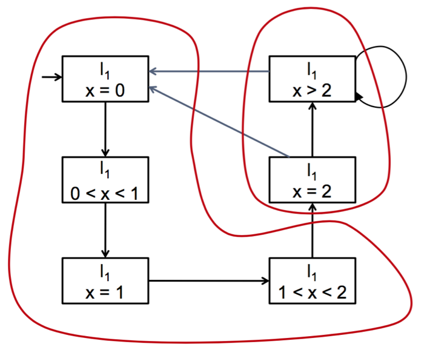
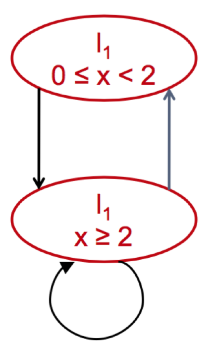

# Quality Assurance Note 2 - Time automata #

这里是关于Quality Assurance课程的第二篇整理笔记

##简介##

Time automata是用于描述系统结构的另一种方法, 和上一篇中提到的Kripke Structure相似.

当我们在使用Kripke Structure 试图描述一个系统的时候, 我们会发现一个问题: Kripke Structure 怎么描述带有时序的系统呢? 

所以我们引入了一个时序变量, 使得状态机能够表达时间的顺序.

这就是今天要说的Time Automata.

##Definition of Time Automata##

Timed Automata, extend finite automata with clocks and clock conditions

- Clocks run continuously (they do not stop)
- All clocks run with the same speed (synchronous and uniform)
- Clocks may be reset to zero (at transitions)
- Clocks may affect which transitions can fire (clock conditions)
- Clock domain: positive real numbers and zero \\((\Re^+ \cup {0})\\)

一般来说, 我们用单个小写字母来表示时钟, 例如 x, y, z.

举个例子!

上面这个图中有两个状态, 在这两个状态之间通过transition连接, 每个状态也有labeling function来表示他们自己 (\\( S_1,S_2 \\), 注意不是 \\(x \leq 2\\), 因为x在这里只是时钟变量, 并不是表达一个状态的labeling function). 

如果只看这三个部分的话, 这张图和普通的Kripke Structure没有任何区别

但是请注意我们这张图上又添加了了一些元素, 例如 \\( x:= 0, x > 1, x \leq 2\\)之类的, 下面就让我们说说这些是什么

-	在transition上面的表达式(x>1, x:=0), 我们称作**guard**(转换条件), 它的解释是
	
	> Transitions can only fire if the current clock values satisfy the guard (guards enable progress)
	
	这里的fire 意思是"发生"
	
- 写在状态上面的表达式 (\\(x \leq 2\\)), 我们称作**invariant**
	> The automaton can only stay in a state as long as the invariant is true (invariants ensure progress)

所以一个time automata应该是这样的:
	

还有许多关于这个图的语义描述和语法描述我就不写下来了, 这种概念的东西背背就好

##Networks of Timed Automata##

涉及到时序的问题的话就会涉及到系统间的消息的传输问题, 就有了同步和异步的概念.

在time automata里面的消息传输有两种方式, 一种是双边同步(Binary Synchronization), 第二种是广播同步(Broadcast Synchronization).

### 双边同步 ###

一方为发送方, 另一方为接收方, 他们两者都是阻塞的. 意思就是只要有一方没有准备好, 另一方就会一直等待.

### 广播同步 ###

一方为发送方, 接收方可以有多个. 接收方式阻塞的, 它们会一直等待消息的到来, 但是发送方是非阻塞的, 一旦发送了消息, 它就会直接进行下一步动作

## Region and Zones ##

Time automata十分好用, 因为它更加接近现实生活. 

但是问题来了, 计算机是一个有限的状态机的集合, 但是time automata是一个无限状态机. (因为从0秒到1秒之间是可以分成无限个时间片段, 现实世界是连续的模拟量!)

我们的解决方案就是把无限的状态机用一个固定的量程切分, 就像尺子把一段距离切分成许多毫米组成的片段一样.

这里我们使用的量程是1秒.

比如这个例子:

时钟是x. 让我们用秒做单位进行切割

1. \\( x = 0\\)
2. \\( 0 < x < 1\\)
3. \\( x = 1\\)
4. \\( 1 < x < 2\\)
5. \\( x = 2\\)
6. \\( 2 < x <3\\)
6. ....

其实从x>2之后我们就没必要再写了, 因为当 \\(x \geq 2\\) 的时候x又会被\\(x:=0\\)赋值成为0.

根据我们分割的结果, 我们就可以画出这样的有限状态机

有没有发现现在的图形就很像是最开始提到的Kripke Structure, 这就是Region操作的意义, 把复杂的Time automata转变为简单的Kripke Structure, 从而使得计算机可以运算.

另外!

上面的图形其实有很多冗余的部分, 比如x=0, 0<x<1, x=1, 1<x<2 这4部分都可以合并在一起, 成为一个状态.

于是我们就像下图一样把一样的地方圈出来!

最后得到的结果是这样!

到此为止, Time Automata就彻底变成Kripke Structure的一部分啦!

## 总结 ##

这个部分主要讲的是怎么用Timed automata来描述一个系统并如何把time automata转变成普通的Kripke Structure. 

就这样!

