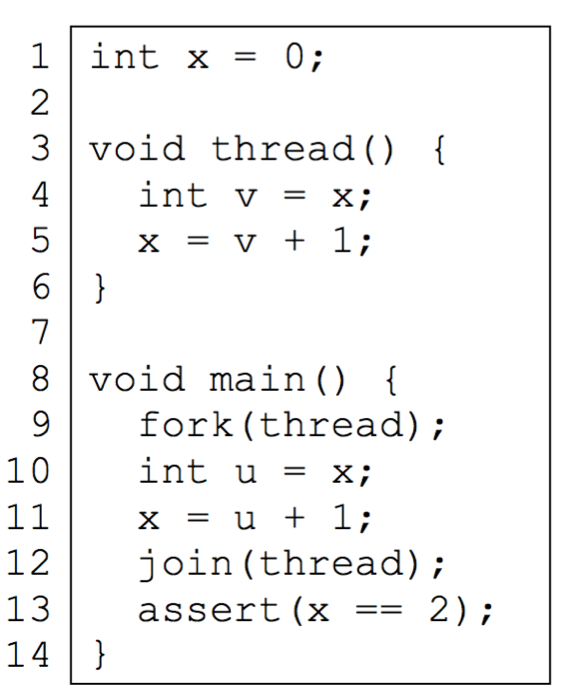
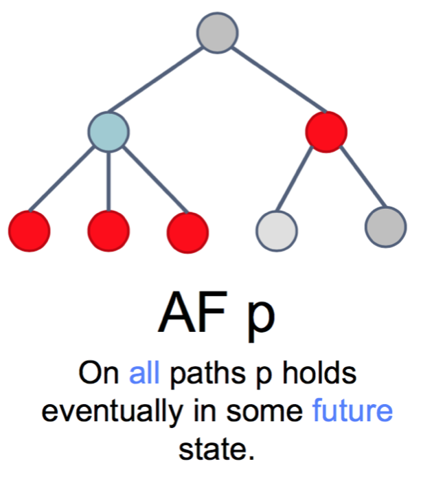
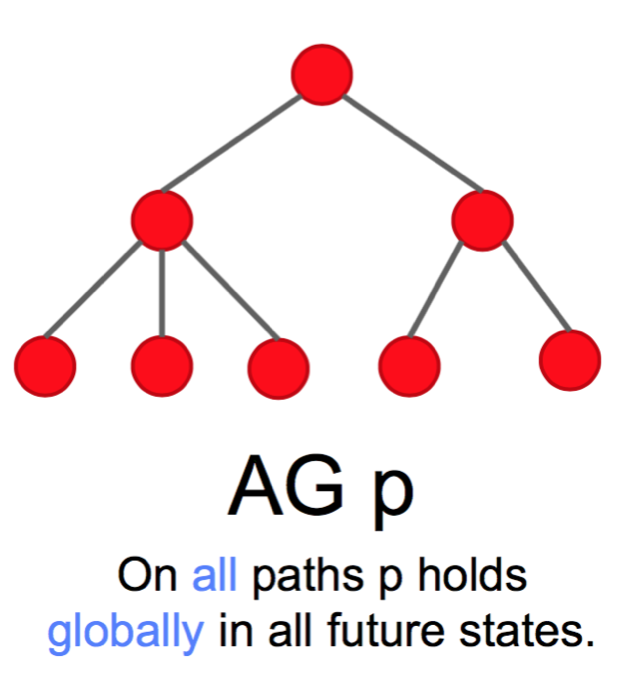
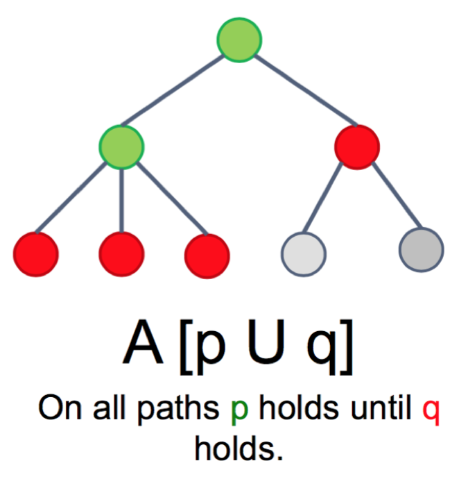

#Quality Assurance Note 1 - Model Checking #

2016.12.15

决定还是用中文.

Quality Assurance of Embedded Systems 是EIT Digital: Embedded Systems第一学期TU Berlin的必修课程

一开始学习的时候觉得挺没劲的感觉都是概念和公式, 但是经过半个学期的学习发现这里面也有些又去的思想和逻辑. 所以就想着反正以后要复习的, 不如现在就把现在的理解记录下来, 对以后的复习也有帮助.

之前做了思维导图, 这里的话就根据思维导图的笔记整理一下.


## 简介

到目前为止, 我们讨论的话题都还是以*model checking*为主. 一般来说保证质量的方法有两种: *Formal Verification*和 *Simulation and Testing*.

Formal Verification(形式化证明):
  
 - Formal proof of properties of a model of the system
 - All possible inputs and system behaviors are considered   Prerequisite: formal model  
- complete and costly


Simulation and Testing(模拟和测试)
   
- Sampled execution of a model (simulation) or of the implementation (testing)
- No universal propositions
- incomplete and cheap and simple


Model Checking是一种Formal Verification  的方法. 

他的目标是: 

>Goal: show that a model of the system (**specification**) satisfies given properties (**requirements**)


就是为了证明某种系统架构确确实实的符合了需求的描述

##How to modelize a system - Kripke Structure ##

先从怎么怎么**描述一个系统的model**开始, 一般来说, 我们用Kripke Structure来描述一个待证明的系统 

略过详细的定义(可以从Wikipedia里面找), 用大白话描述一下这个东西.

一个完整的Kripke Structure由四个部分组成:

1. 一个**有限**的状态集合
2. 一个初始状态的集合(意味着可能有多个初始状态)
3. 从两个状态之间的转换(transition) 
4. 每个状态要有个labeling function, 也就是状态的描述式

举个例子1!

比如有这么一段C代码(为了有行号我要贴图)



我们可以从这段代码找到这几个变量

1. int x
2. int v
3. int u
2. main线程的行号计数器\\(pc_m\\)
3. thread线程的行号计数器\\(pc_t\\)

先说明一下`join()`函数的意思是等待线程的结束, 在这个例子1里面就是等待`thread()`线程返回.

于是根据代码一步步往下走就能得到完整的Kripke Structure.


下面说说画Kripke Structure的几个要注意的地方:

1. 行号计数器的值为某一行时, 这一行的代码并未被执行. 被执行的是上一行的代码:

	例如, 初始状态是\\((x=0,pc_m=9)\\), 在这个状态的时候`fork(thread)`并未被执行, 所以 \\(pc_t= \emptyset \\) ( \\( \emptyset \\) 是空集的意思 )
	
	再比如在 \\( (x=0,pc_m=11,u=0,pc_t=5,v=0) \\)的状态时, 虽然 已经有了 \\(pc_t=5\\), 但是x并没有被赋值.

2. 建议是每一步都画下来, 因为后面有算法去精简的, 所以没必要吝啬笔墨

##How to describe a requirement - LTL & CTL##

这里说的是**怎么描述需求!** 这一点一定要牢记

先从三个不怎么重要的概念开始, 可以略过

怎么定义一个需求的重要程度

我们可以分成3个不同的等级.

1. Safety: something bad will never happen
2. Liveness: something good will eventually happen
3. Fairness: something is true infinitely often

第三个有点难翻译...意思就是好的事情会发生, 坏的事情也会发生, 而且他们发生的概率是相同的. (想想fairness - 公平的)

下面说两种描述

### LTL (Linear Temporal Logic) ###

如果一系列在需求中的一系列事件是顺序发生, 而且只有一条执行路径, 那么就可以用LTL描述

### CTL (Computation Tree Logic) ###

如果这些需求里面可能有多条执行路径, 那么就可以用CTL 描述

举个例子2!

举个起床的例子...

LTL:

```
早上7→点闹钟响了→醒了→下床
```
因为没有其他的可能性了, 所以是LTL

CTL:

```
 下床 ┬→刷牙-洗脸━┳→吃早餐
     └→洗脸-刷牙━┛
```

在下床之后出现了两条路径, 先洗脸和先刷牙, 所以这就是CTL

接下来就是这一段的重点了, 背一大堆符号表, 因为我们可以用这一对符号来描述需求!

决定直接贴图算了, 要详述的话再说.

用来描述LTL的符号:


用来描述CTL的符号


可以看到描述CTL的符号比LTL的就多了几个`Path quantifier`而已.

下面是几个基本的CTL用到的表述, **重要**!

---

---

---

---

---

---

---

---

---


